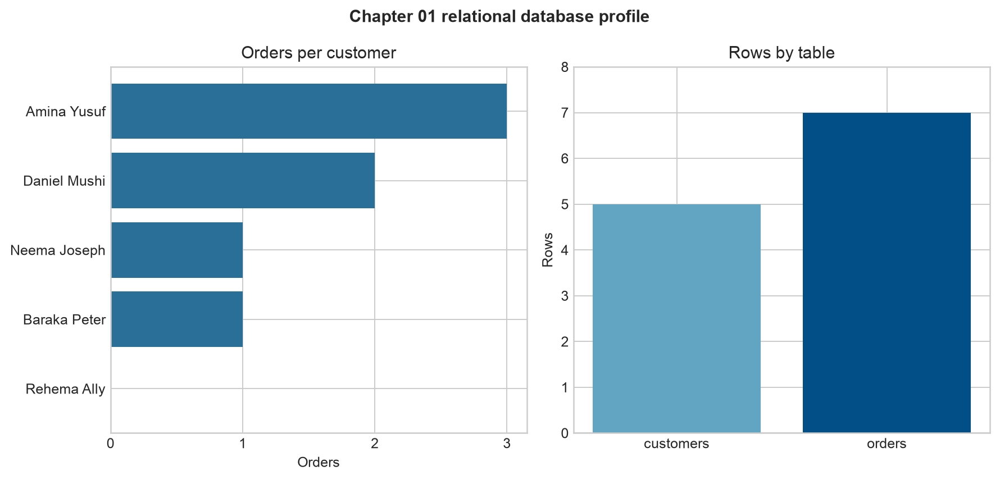

# Relational Databases and Tables {#sec-relational-databases-and-tables}

:::cdi-message
- **ID:** DSDP-001
- **Type:** Foundation chapter
- **Audience:** Data analysts, data scientists, and developers beginning database work
- **Theme:** Organizing related data into reliable tables
:::

## Learning objectives {#sec-01-learning-objectives}

By the end of this chapter, you will be able to:

1. explain why databases are preferable to disconnected files for many analytical systems;
2. distinguish a database, a relational database, a table, a row, and a column;
3. choose appropriate column types and constraints;
4. identify primary and foreign keys;
5. describe one-to-one, one-to-many, and many-to-many relationships;
6. create and inspect a small SQLite database; and
7. recognize the boundary between a table's structure and the records stored in it.

## From files to managed data {#sec-01-files-to-managed-data}

A CSV file is often an excellent starting point. It is portable, readable, and easy to load with Python. Problems emerge when several files describe the same system and must remain consistent. A customer identifier may be entered differently in two files, an order may refer to a customer who does not exist, or two people may overwrite the same file.

A **database** is an organized collection of data managed by software called a **database management system** (DBMS). The DBMS provides controlled ways to store, retrieve, update, validate, and protect data. Examples include SQLite, PostgreSQL, MySQL, SQL Server, and Oracle Database.

A **relational database** represents data in tables and connects those tables through shared keys. The relational model is valuable because it makes relationships explicit and allows the DBMS to enforce important rules.

| Flat-file challenge | Relational response |
|---|---|
| Customer details repeated for every order | Store customers once and reference them by key |
| Unknown or inconsistent data types | Declare column types |
| Orders for nonexistent customers | Enforce a foreign-key constraint |
| Accidental duplicate identifiers | Enforce a primary key or unique constraint |
| Multiple copies become inconsistent | Maintain one authoritative record |

Databases do not replace every file. Files remain useful for exchange, archives, and analytical outputs. A database becomes especially useful when data is related, updated repeatedly, shared by several processes, or required to satisfy consistency rules.

## The relational vocabulary {#sec-01-relational-vocabulary}

Consider a small retail system with two tables:

- `customers` stores one row per customer;
- `orders` stores one row per order.

In relational terminology:

- a **table** represents one kind of entity or event;
- a **row** is one record;
- a **column** is one named attribute;
- a **schema** describes the database structure;
- a **key** identifies or connects records; and
- a **constraint** is a rule the database enforces.

The schema and the data are different. The schema states that `customer_id` is an integer primary key; the data contains values such as `101` and `102`. This distinction becomes important when databases evolve and pipelines validate incoming records.

## Tables, rows, and columns {#sec-01-tables-rows-columns}

A well-scoped table usually represents a single subject. Mixing customer, order, product, and payment attributes into one wide table creates repetition and makes updates harder to control.

The example `customers` table has this logical structure:

| Column | Type | Rule | Meaning |
|---|---|---|---|
| `customer_id` | INTEGER | Primary key | Stable customer identifier |
| `customer_name` | TEXT | Required | Customer's display name |
| `region` | TEXT | Required | Reporting region |
| `signup_date` | TEXT | Required | ISO-formatted date in this SQLite example |

The `orders` table records transactions:

| Column | Type | Rule | Meaning |
|---|---|---|---|
| `order_id` | INTEGER | Primary key | Stable order identifier |
| `customer_id` | INTEGER | Foreign key | Customer who placed the order |
| `order_date` | TEXT | Required | ISO-formatted order date |
| `amount` | REAL | Nonnegative check | Order value |
| `status` | TEXT | Allowed-value check | Order lifecycle state |

SQLite uses a flexible type system, but declaring meaningful types still communicates intent and supports validation. Production systems such as PostgreSQL provide a wider range of strict types, including dedicated date, timestamp, numeric, JSON, and array types.

## Keys create identity and relationships {#sec-01-keys}

### Primary keys {#sec-01-primary-keys}

A **primary key** uniquely identifies each row. Good primary keys are unique, never null, and stable over time. In this chapter, `customer_id` identifies customers and `order_id` identifies orders.

Names are poor primary keys because two people may share a name and a person's name can change. A generated integer or UUID is usually safer. A key made from one column is a **simple key**; one made from several columns is a **composite key**.

### Foreign keys {#sec-01-foreign-keys}

A **foreign key** is a column, or group of columns, whose values refer to a candidate key in another table. `orders.customer_id` refers to `customers.customer_id`.

```text
customers.customer_id  1 ───────< many  orders.customer_id
```

With foreign-key enforcement enabled, the database rejects an order for a customer that does not exist. This rule is called **referential integrity**.

## Relationship patterns {#sec-01-relationship-patterns}

Relational designs commonly express three patterns:

| Relationship | Meaning | Example |
|---|---|---|
| One-to-one | One row relates to at most one row | One employee and one current security badge |
| One-to-many | One parent relates to many children | One customer and many orders |
| Many-to-many | Many rows relate to many rows | Many orders containing many products |

A many-to-many relationship is implemented through an intermediate table. For example, `order_items(order_id, product_id, quantity)` links orders and products. Its primary key may combine `order_id` and `product_id`, while each column is also a foreign key.

## Constraints protect data quality {#sec-01-constraints}

Constraints convert business rules into checks performed by the database:

- `PRIMARY KEY` prevents missing or duplicated row identities;
- `FOREIGN KEY` protects relationships;
- `NOT NULL` requires a value;
- `UNIQUE` prevents duplicates in a candidate key;
- `CHECK` restricts acceptable values; and
- `DEFAULT` supplies a value when one is omitted.

For example:

```sql
CREATE TABLE orders (
    order_id    INTEGER PRIMARY KEY,
    customer_id INTEGER NOT NULL,
    order_date  TEXT NOT NULL,
    amount      REAL NOT NULL CHECK (amount >= 0),
    status      TEXT NOT NULL
                CHECK (status IN ('pending', 'completed', 'cancelled')),
    FOREIGN KEY (customer_id) REFERENCES customers(customer_id)
);
```

Constraints do not eliminate the need for pipeline validation. They form the final defensive boundary that prevents invalid records from entering the stored system.

## Practical: build a small SQLite database {#sec-01-practical}

SQLite stores a complete relational database in one file and is included with Python. It is therefore ideal for learning, local analysis, tests, and embedded applications.

The chapter package contains:

- `data/raw/01-customers.csv` and `data/raw/01-orders.csv` as source data;
- `scripts/sql/01-create-retail-schema.sql` as the schema definition;
- `scripts/python/01-build-retail-database.py` as the reproducible build and validation workflow; and
- `scripts/bash/01-build-retail-database.sh` as a convenient command-line entry point.

From the repository root, run:

```bash
bash scripts/bash/01-build-retail-database.sh
```

The workflow recreates `data/processed/01-retail-demo.sqlite`, loads both CSV files in one transaction, validates the relationship, and writes `results/01-table-summary.csv` plus `results/figures/01-relational-table-profile.png`.

The validation query summarizes customers and their orders:

```sql
SELECT
    c.customer_id,
    c.customer_name,
    COUNT(o.order_id) AS order_count,
    COALESCE(SUM(o.amount), 0) AS total_amount
FROM customers AS c
LEFT JOIN orders AS o
    ON c.customer_id = o.customer_id
GROUP BY c.customer_id, c.customer_name
ORDER BY c.customer_id;
```

The `LEFT JOIN` retains customers even when they have no orders. Joins are developed fully in @sec-joins-relational-thinking; here, the query simply verifies that the two-table design behaves as intended.

{#fig-01-relational-table-profile fig-alt="Two horizontal bar charts showing the number of orders per customer and one overall bar comparing customer and order row counts."}

## Inspect the database {#sec-01-inspect-database}

If the SQLite command-line program is installed, inspect the generated database with:

```bash
sqlite3 data/processed/01-retail-demo.sqlite
```

Then run:

```sql
.tables
.schema customers
.schema orders
SELECT * FROM customers;
SELECT * FROM orders;
PRAGMA foreign_key_check;
```

An empty result from `PRAGMA foreign_key_check` means SQLite found no broken foreign-key relationships.

The same inspection is available from Python:

```python
import sqlite3

with sqlite3.connect("data/processed/01-retail-demo.sqlite") as connection:
    connection.execute("PRAGMA foreign_keys = ON")
    tables = connection.execute(
        "SELECT name FROM sqlite_master WHERE type = 'table' ORDER BY name"
    ).fetchall()
    print(tables)
```

Always enable foreign-key enforcement explicitly for each SQLite connection. Other relational database systems commonly enforce it by default.

## Common design mistakes {#sec-01-common-mistakes}

### Repeating groups in one row {#sec-01-repeating-groups}

Columns such as `product_1`, `product_2`, and `product_3` impose an artificial limit and complicate queries. Store repeated items as rows in a related table.

### Storing several values in one column {#sec-01-multiple-values-column}

A value such as `"SQL,Python,Git"` is difficult to validate and join. If skills are meaningful entities, create a `skills` table and an employee-skills bridge table.

### Using mutable labels as keys {#sec-01-mutable-keys}

Names, email addresses, and product descriptions can change. Use stable identifiers and place human-readable labels in separate columns.

### Treating missing values as empty strings {#sec-01-null-empty}

`NULL`, an empty string, and zero have different meanings. Decide what absence means for each attribute and represent it consistently.

### Assuming the database will infer every rule {#sec-01-inferred-rules}

A declared data type alone cannot express every business rule. Add suitable constraints and validate requirements that span multiple tables in the application or pipeline layer.

## Check your understanding {#sec-01-check-understanding}

1. Why is `customer_name` a weaker primary key than `customer_id`?
2. Which constraint prevents an order from referencing an unknown customer?
3. How would you represent products that appear in many orders?
4. What is the difference between a database schema and the rows stored in it?
5. When might a CSV file still be preferable to a database table?

## Chapter summary {#sec-01-summary}

A relational database organizes data into focused tables and links those tables through keys. Primary keys establish row identity; foreign keys establish valid relationships; and constraints protect essential rules. The resulting structure reduces unnecessary repetition and provides a dependable foundation for SQL queries and data pipelines.

The next chapter introduces SQL as the language for retrieving and shaping data from these tables.

