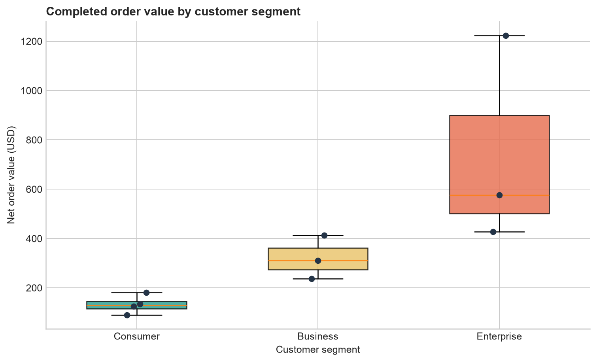

# Querying Data with SQL {#sec-querying-with-sql}

:::cdi-message
- **ID:** DBSQL-002
- **Type:** Core lesson and guided practical
- **Audience:** Beginning data practitioners working with relational data
- **Theme:** Turning analytical questions into precise, readable SQL queries
:::

SQL becomes useful when a question about data can be translated into a query whose output is predictable. This chapter develops that translation step by step. The examples use a small SQLite retail database, but the central ideas—selecting columns, filtering rows, calculating values, sorting results, and handling missing data—transfer directly to PostgreSQL, MySQL, SQL Server, DuckDB, and other relational systems.

## Learning objectives

By the end of this chapter, you will be able to:

- inspect tables before querying them;
- select explicit columns with `SELECT` and identify a source with `FROM`;
- rename output columns and calculate derived values;
- filter rows with comparison, range, set, pattern, and null conditions;
- combine conditions safely with `AND`, `OR`, and parentheses;
- sort results and return a controlled number of rows;
- explain SQL's logical query-processing order; and
- write readable queries whose output columns form an explicit contract.

## The chapter case study

The practical uses three related tables:

| Table | Grain | Purpose |
|---|---|---|
| `customers` | One row per customer | Customer identity, segment, location, and signup date |
| `products` | One row per product | Product name, category, price, and active status |
| `orders` | One row per order | Customer, product, date, quantity, discount, and status |

The **grain** describes what one row represents. Knowing it prevents incorrect interpretations. In `orders`, for example, one row is one product order—not one customer and not one unit sold.

The repository workflow creates the database locally:

```bash
bash scripts/bash/02-run-querying-data.sh
```

It writes the SQLite database to `data/processed/02-retail.db`, query outputs to `results/02-querying-data/`, and a figure to `results/figures/`.

## Start by inspecting the database {#sec-inspecting-tables}

Before answering an analytical question, inspect the available tables and their columns. SQLite exposes table metadata through `PRAGMA` statements:

```sql
SELECT name
FROM sqlite_master
WHERE type = 'table'
ORDER BY name;

PRAGMA table_info(orders);
```

The first statement lists tables. The second describes the `orders` columns, declared types, nullability, defaults, and primary-key position. Other database systems provide equivalent metadata through information-schema views or client commands.

A short preview helps verify the values and the table grain:

```sql
SELECT order_id, customer_id, product_id, order_date,
       quantity, discount_rate, status
FROM orders
ORDER BY order_id
LIMIT 5;
```

Inspection is not a substitute for documentation, but it catches common mistakes early: wrong table names, unexpected date formats, unclear codes, and nullable fields.

## Build a query with `SELECT` and `FROM` {#sec-select-from}

The smallest useful query has two clauses:

```sql
SELECT customer_id, customer_name, segment
FROM customers;
```

`SELECT` defines the output columns. `FROM` defines the source relation. A semicolon terminates the statement.

Although `SELECT *` is convenient during brief exploration, explicit column names are better for reusable analysis:

```sql
SELECT order_id, order_date, quantity, status
FROM orders;
```

Explicit selection makes the output contract visible, avoids transferring unused columns, and protects downstream work when new source columns are added.

### Remove duplicate output rows

`DISTINCT` removes duplicate combinations from the selected output:

```sql
SELECT DISTINCT segment, country
FROM customers
ORDER BY segment, country;
```

It does not modify the table. It applies only to the query result, and it considers the complete selected column combination.

## Make outputs clearer with aliases {#sec-aliases-expressions}

An alias gives an output column a readable name:

```sql
SELECT
    product_name AS product,
    unit_price AS listed_price
FROM products;
```

Aliases are especially important for calculated columns. The following query computes gross and net order values:

```sql
SELECT
    order_id,
    quantity,
    unit_price_at_order,
    discount_rate,
    quantity * unit_price_at_order AS gross_value,
    quantity * unit_price_at_order * (1 - discount_rate) AS net_value
FROM orders;
```

The stored `unit_price_at_order` preserves the historical price used for the transaction. Using the current price from `products` could silently rewrite history after a price change.

SQLite uses dynamic typing, so arithmetic may produce more decimal places than desired. `ROUND` makes the displayed values easier to read:

```sql
SELECT
    order_id,
    ROUND(quantity * unit_price_at_order, 2) AS gross_value,
    ROUND(quantity * unit_price_at_order * (1 - discount_rate), 2) AS net_value
FROM orders;
```

## Filter rows with `WHERE` {#sec-where-filtering}

`WHERE` keeps rows for which its condition evaluates to true:

```sql
SELECT order_id, order_date, status
FROM orders
WHERE status = 'completed';
```

Text literals use single quotes. Numeric values do not:

```sql
SELECT product_id, product_name, unit_price
FROM products
WHERE unit_price >= 100;
```

Common comparison operators include `=`, `<>`, `<`, `<=`, `>`, and `>=`. SQL also supports specialized predicates for ranges, sets, patterns, and missing values.

### Filter ranges with `BETWEEN`

`BETWEEN` includes both boundaries:

```sql
SELECT order_id, order_date, status
FROM orders
WHERE order_date BETWEEN '2026-01-01' AND '2026-01-31';
```

The sample dates use ISO format (`YYYY-MM-DD`), which sorts chronologically as text. For timestamp columns, a half-open interval is often safer because it includes every time on the starting date while excluding the next period:

```sql
WHERE created_at >= '2026-01-01'
  AND created_at <  '2026-02-01'
```

### Match a set with `IN`

`IN` is clearer than repeating several equality checks:

```sql
SELECT order_id, status
FROM orders
WHERE status IN ('completed', 'shipped');
```

Its opposite is `NOT IN`, but nullable values require care because SQL uses three-valued logic. For exclusions involving nulls, make the intended null behavior explicit.

### Match text patterns with `LIKE`

`LIKE` uses `%` for any sequence of characters and `_` for one character:

```sql
SELECT customer_id, customer_name
FROM customers
WHERE customer_name LIKE 'A%';
```

Case-sensitivity varies by database and collation. Do not assume every database treats patterns exactly like SQLite.

### Combine conditions deliberately

`AND` requires both conditions to be true. `OR` requires at least one:

```sql
SELECT customer_id, customer_name, segment, country
FROM customers
WHERE country = 'Tanzania'
  AND segment = 'Business';
```

SQL evaluates `AND` before `OR`. Parentheses make the intended grouping explicit:

```sql
SELECT customer_id, customer_name, segment, country
FROM customers
WHERE country = 'Tanzania'
  AND (segment = 'Business' OR segment = 'Enterprise');
```

Without the parentheses, enterprise customers from every country would also qualify.

## Handle missing values correctly {#sec-null-values}

`NULL` represents an absent or unknown value. It is not an empty string, zero, or the text `'NULL'`. Because an unknown value cannot be proven equal to anything, this condition is incorrect:

```sql
-- Incorrect: this does not find missing values.
WHERE shipped_date = NULL
```

Use `IS NULL` or `IS NOT NULL`:

```sql
SELECT order_id, status, shipped_date
FROM orders
WHERE shipped_date IS NULL;
```

`COALESCE` returns the first non-null expression and can create a display value:

```sql
SELECT
    order_id,
    COALESCE(shipped_date, 'not shipped') AS shipping_date
FROM orders;
```

Use replacement values carefully. They can simplify reporting, but they can also erase the distinction between an unknown value and a genuine category.

## Sort and limit results {#sec-order-limit}

Relational tables have no guaranteed display order. Use `ORDER BY` whenever order matters:

```sql
SELECT order_id, order_date, quantity
FROM orders
ORDER BY order_date DESC, order_id ASC;
```

`ASC` is ascending and is the default. `DESC` is descending. A second sort key makes ties deterministic.

`LIMIT` controls the number of returned rows:

```sql
SELECT product_id, product_name, unit_price
FROM products
ORDER BY unit_price DESC, product_id
LIMIT 3;
```

For a meaningful “top three,” sort before limiting. A limit without an order returns an arbitrary subset from the reader's perspective.

## Understand logical query processing {#sec-logical-query-order}

SQL is written in one order but conceptually evaluated in another:

| Logical stage | Clause | Role |
|---:|---|---|
| 1 | `FROM` | Identify source rows |
| 2 | `WHERE` | Filter source rows |
| 3 | `SELECT` | Calculate and name output columns |
| 4 | `DISTINCT` | Remove duplicate output rows |
| 5 | `ORDER BY` | Sort the result |
| 6 | `LIMIT` | Keep a requested number of rows |

This model explains why a `SELECT` alias is often unavailable in `WHERE`: filtering logically occurs before the alias is created. It also explains why `ORDER BY` can commonly use an output alias:

```sql
SELECT
    order_id,
    ROUND(quantity * unit_price_at_order * (1 - discount_rate), 2) AS net_value
FROM orders
WHERE status = 'completed'
ORDER BY net_value DESC;
```

Exact syntax and optimizer behavior vary by database, but this logical model is a reliable way to reason about query meaning.

## Guided practical: answer a business question {#sec-guided-query-practical}

Suppose the operations team asks:

> Which completed or shipped orders placed from 1 January through 15 February 2026 have a net value of at least USD 100, and which should be reviewed first?

Translate the request into explicit rules:

1. Source: `orders`.
2. Status: `completed` or `shipped`.
3. Date interval: from `2026-01-01` through `2026-02-15`.
4. Metric: quantity multiplied by historical unit price after discount.
5. Threshold: net value at least 100.
6. Priority: highest net value first, then lowest order ID for ties.

The resulting query is:

```sql
SELECT
    order_id,
    customer_id,
    product_id,
    order_date,
    status,
    ROUND(quantity * unit_price_at_order * (1 - discount_rate), 2) AS net_value
FROM orders
WHERE status IN ('completed', 'shipped')
  AND order_date BETWEEN '2026-01-01' AND '2026-02-15'
  AND quantity * unit_price_at_order * (1 - discount_rate) >= 100
ORDER BY net_value DESC, order_id ASC;
```

Notice that the full calculation appears in `WHERE`, while the alias is used in `ORDER BY`. The output is an auditable contract: every column and rule can be traced back to the original request.

## Reproducible chapter workflow {#sec-query-workflow}

The chapter files divide responsibilities clearly:

| File | Responsibility |
|---|---|
| `scripts/sql/02-create-retail-database.sql` | Define tables and insert deterministic sample data |
| `scripts/sql/02-querying-data.sql` | Store the teaching queries in executable form |
| `scripts/python/02-run-querying-data.py` | Build the database, execute named queries, export CSV files, and plot results |
| `scripts/bash/02-run-querying-data.sh` | Provide one command from the repository root |

Run the complete workflow:

```bash
bash scripts/bash/02-run-querying-data.sh
```

Expected console summary:

```text
Database created: data/processed/02-retail.db
Exported 6 query result files: results/02-querying-data
Figure created: results/figures/02-order-value-by-segment.png
All validation checks passed.
```

The generated figure compares completed order values across customer segments. It is a downstream use of query output—not a replacement for inspecting the actual result rows.

{#fig-order-value-segment fig-alt="Box plots comparing completed net order values for Consumer, Business, and Enterprise customer segments."}

## Query-quality checklist {#sec-query-quality-checklist}

Before treating a query as finished, check that:

- the source table and row grain match the question;
- selected columns are explicit and meaningfully named;
- text and date literals are quoted correctly;
- date boundaries express the intended interval;
- mixed `AND` and `OR` logic is grouped with parentheses;
- missing values use `IS NULL` or `IS NOT NULL`;
- calculated values use the appropriate source columns;
- sorting is explicit when order matters;
- ties have a deterministic secondary sort; and
- the result has been checked against known rows or validation assertions.

## Common mistakes {#sec-querying-common-mistakes}

### Assuming row order

A query without `ORDER BY` does not promise a particular order, even if repeated runs appear stable.

### Using `SELECT *` as a permanent interface

It hides the intended schema and makes downstream code vulnerable to source changes.

### Comparing nulls with equality

Use `IS NULL`, not `= NULL`.

### Forgetting operator precedence

Parenthesize mixed `AND` and `OR` conditions so that the business rule is visible.

### Limiting before defining “top”

Use `ORDER BY` and then `LIMIT`; otherwise, “top” has no defined meaning.

### Confusing display rounding with filtering logic

Decide whether thresholds apply to the original value or the rounded display value, then encode that decision consistently.

## Exercises {#sec-querying-exercises}

1. Return the names and prices of active products costing between USD 25 and USD 150, ordered from most to least expensive.
2. Find orders that have not shipped. Include the order ID, status, and a readable shipping label produced with `COALESCE`.
3. Return customers whose names begin with `M` or `S`, ordered alphabetically.
4. Calculate gross value, discount amount, and net value for every order. Round display values to two decimal places.
5. Return the five highest-value completed orders. Make the ordering deterministic.
6. Explain why `WHERE net_value >= 100` may fail when `net_value` is defined as a `SELECT` alias.
7. Modify the guided-practical query to use a half-open date interval ending on `2026-02-16`.

## Chapter summary

A reliable SQL query begins with the question and the row grain. `SELECT` defines the output, `FROM` identifies the source, `WHERE` filters rows, `ORDER BY` makes sequence explicit, and `LIMIT` controls result size. Aliases and expressions turn raw columns into useful outputs, while null-aware predicates preserve correct logic. These foundations prepare us for aggregation and grouping in the next chapter, where queries move from individual rows to summaries.

