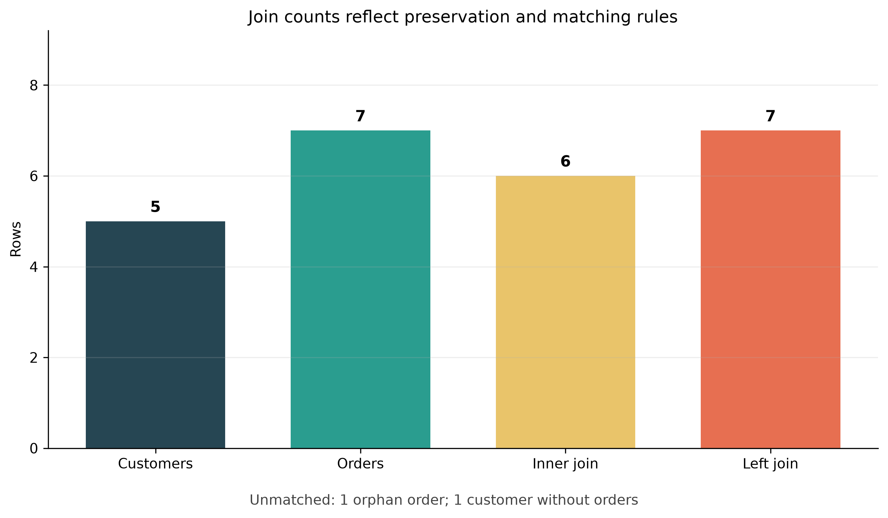

# Joins and Relational Thinking {#sec-joins-and-relational-thinking}

:::cdi-message
- **ID:** DSDP-04
- **Type:** Core
- **Audience:** Data analysts, data scientists, and beginning data engineers
- **Theme:** Reliable joins begin with table grain, keys, cardinality, and explicit validation
:::

## Learning objectives

By the end of this chapter, you will be able to:

- explain why related facts are stored in separate tables;
- identify table grain, primary keys, and foreign keys before joining;
- use `INNER`, `LEFT`, `RIGHT`, `FULL OUTER`, `CROSS`, and self joins appropriately;
- reason about one-to-one, one-to-many, and many-to-many relationships;
- prevent accidental row multiplication with pre-aggregation and bridge tables;
- detect unmatched keys, duplicate keys, and null-related join failures; and
- validate join outputs with counts, assertions, and reconciliation queries.

## From isolated tables to relational questions

A relational database separates entities and events into tables that can be
connected through keys. A customer table stores one row per customer. An order
table stores one row per order. An order-item table stores one row per product
line within an order. This separation avoids repeating customer attributes on
every transaction and makes each table responsible for one kind of fact.

The analytical question usually spans those boundaries:

> Which customers ordered, what did they buy, and how much revenue did each
> customer generate?

Answering it correctly requires more than knowing the `JOIN` keyword. It
requires relational thinking: define what one row represents, identify the
relationship between tables, predict the expected output grain, and verify the
result.

The executable Chapter 04 workflow creates a small SQLite database, runs
diagnostic and analytical joins, and saves reproducible outputs:

```bash
bash scripts/bash/04-run-join-analysis.sh
```

The Python script uses only the standard library and `matplotlib`. It writes
tables under `results/tables/` and the diagnostic figure under
`results/figures/`.

## Begin with table grain

The **grain** states what one row represents. State it before writing a join.

| Table | Grain | Candidate key |
|---|---|---|
| `customers` | One row per customer | `customer_id` |
| `orders` | One row per order | `order_id` |
| `order_items` | One row per product line in an order | `(order_id, product_id)` |
| `products` | One row per product | `product_id` |

If `customers` is joined to `orders`, the natural output grain becomes one row
per order, with customer attributes repeated for customers who placed multiple
orders. If `orders` is then joined to `order_items`, the grain becomes one row
per order line. The row count can increase without any duplication error: the
data is simply being expressed at a finer grain.

:::callout-warning
## Repeated values are not automatically duplicates

After a valid one-to-many join, values from the "one" side repeat. Removing
those rows with `DISTINCT` can discard legitimate events. Diagnose the
relationship and intended grain instead of hiding unexpected counts.
:::

## Keys define relationships

A **primary key** uniquely identifies a row in its table. A **foreign key**
references a key in another table. Together they express both identity and
relationship.

```sql
CREATE TABLE customers (
    customer_id INTEGER PRIMARY KEY,
    customer_name TEXT NOT NULL,
    region TEXT NOT NULL
);

CREATE TABLE orders (
    order_id INTEGER PRIMARY KEY,
    customer_id INTEGER,
    order_date TEXT NOT NULL,
    status TEXT NOT NULL,
    FOREIGN KEY (customer_id) REFERENCES customers(customer_id)
);
```

A nullable foreign key can be intentional, but it changes join behaviour.
SQL's equality comparison does not treat `NULL` as equal to another `NULL`.
Missing keys therefore require explicit investigation rather than an assumption
that they will match.

## Join anatomy and aliases

The essential join pattern names the left table, the right table, and the
condition that relates their rows:

```sql
SELECT
    o.order_id,
    o.order_date,
    c.customer_name,
    c.region
FROM orders AS o
JOIN customers AS c
  ON o.customer_id = c.customer_id;
```

Aliases keep multi-table queries readable and make column ownership explicit.
Qualify shared names such as `customer_id`, and select the columns required by
the output contract instead of relying on `SELECT *`.

## Inner joins: retain matches

An `INNER JOIN` returns rows whose join condition matches on both sides.
`INNER` is optional, so `JOIN` and `INNER JOIN` mean the same thing.

```sql
SELECT
    c.customer_id,
    c.customer_name,
    o.order_id,
    o.order_date
FROM customers AS c
INNER JOIN orders AS o
  ON c.customer_id = o.customer_id
ORDER BY c.customer_id, o.order_date;
```

This is appropriate when the analysis requires a valid relationship on both
sides. It is not appropriate when customers without orders must remain visible.
An inner join can silently remove unmatched records, so count them separately.

## Left joins: preserve the analytical population

A `LEFT JOIN` retains every row from the left table and fills right-side
columns with `NULL` when no match exists.

```sql
SELECT
    c.customer_id,
    c.customer_name,
    COUNT(o.order_id) AS order_count
FROM customers AS c
LEFT JOIN orders AS o
  ON c.customer_id = o.customer_id
GROUP BY c.customer_id, c.customer_name
ORDER BY c.customer_id;
```

The placement of filters matters. Suppose cancelled orders should not count,
but customers with no qualifying orders must remain:

```sql
SELECT
    c.customer_id,
    COUNT(o.order_id) AS completed_orders
FROM customers AS c
LEFT JOIN orders AS o
  ON c.customer_id = o.customer_id
 AND o.status = 'completed'
GROUP BY c.customer_id;
```

Putting `o.status = 'completed'` in a `WHERE` clause would reject the null-filled
rows and effectively convert the outer join into an inner join.

:::callout-tip
## Count a right-side key after a left join

Use `COUNT(o.order_id)`, not `COUNT(*)`, when measuring matches. `COUNT(*)`
counts the preserved customer row even when no order matched.
:::

## Right and full outer joins

A `RIGHT JOIN` preserves every row from the right table. It can often be
rewritten as a `LEFT JOIN` by swapping table order. A `FULL OUTER JOIN` preserves
matched rows plus unmatched rows from both sides.

```sql
SELECT
    c.customer_id,
    c.customer_name,
    o.order_id
FROM customers AS c
FULL OUTER JOIN orders AS o
  ON c.customer_id = o.customer_id;
```

These joins are useful for reconciliation: records present only in the source,
only in the target, or in both. Database support varies by engine and version,
so confirm the dialect used by the project. A portable reconciliation can be
built from left anti-joins and `UNION ALL`.

## Anti-joins and semi-joins

An **anti-join** returns left-side rows with no match. It is a powerful data
quality diagnostic.

```sql
SELECT o.*
FROM orders AS o
LEFT JOIN customers AS c
  ON o.customer_id = c.customer_id
WHERE c.customer_id IS NULL;
```

`NOT EXISTS` expresses the same intention directly and behaves safely when the
comparison table contains nulls:

```sql
SELECT o.*
FROM orders AS o
WHERE NOT EXISTS (
    SELECT 1
    FROM customers AS c
    WHERE c.customer_id = o.customer_id
);
```

A **semi-join** returns left-side rows for which a match exists, without adding
right-side columns or multiplying the left rows:

```sql
SELECT c.*
FROM customers AS c
WHERE EXISTS (
    SELECT 1
    FROM orders AS o
    WHERE o.customer_id = c.customer_id
);
```

Prefer `EXISTS` when the question is simply whether a related record exists.

## Join cardinality

Cardinality describes how many rows on one side may relate to a row on the
other side.

| Relationship | Meaning | Expected row-count behaviour |
|---|---|---|
| One-to-one | Each key appears at most once on both sides | At most one output row per matched key |
| One-to-many | A unique parent key relates to many child rows | Parent attributes repeat at child grain |
| Many-to-one | Many left rows relate to one unique lookup row | Left row count is preserved for complete matches |
| Many-to-many | Keys repeat on both sides | Rows multiply within each shared key |

Inspect key uniqueness before joining:

```sql
SELECT customer_id, COUNT(*) AS rows_per_key
FROM customers
GROUP BY customer_id
HAVING COUNT(*) > 1;
```

Run the equivalent check on both inputs. If the join key repeats on both sides,
the number of rows for a key is the product of the two group sizes. Three left
rows joined to four right rows produce twelve rows for that key.

## Many-to-many relationships need an explicit model

Orders and products form a valid many-to-many relationship: one order can
contain many products, and one product can appear in many orders. A bridge table
resolves the relationship:

```text
orders 1 ----< order_items >---- 1 products
```

`order_items` has its own grain and measures such as quantity and unit price.

```sql
SELECT
    oi.order_id,
    p.product_name,
    oi.quantity,
    oi.quantity * oi.unit_price AS line_revenue
FROM order_items AS oi
JOIN products AS p
  ON oi.product_id = p.product_id;
```

Do not join `orders` directly to `products` on a non-key descriptive field. Use
the bridge that records which product participated in which order.

## Aggregate at the intended grain

To calculate one row per customer, first compute order totals at the order
grain, then aggregate them to the customer grain:

```sql
WITH order_totals AS (
    SELECT
        o.order_id,
        o.customer_id,
        SUM(oi.quantity * oi.unit_price) AS order_revenue
    FROM orders AS o
    JOIN order_items AS oi
      ON o.order_id = oi.order_id
    WHERE o.status = 'completed'
    GROUP BY o.order_id, o.customer_id
)
SELECT
    c.customer_id,
    c.customer_name,
    COUNT(ot.order_id) AS completed_orders,
    COALESCE(SUM(ot.order_revenue), 0) AS revenue
FROM customers AS c
LEFT JOIN order_totals AS ot
  ON c.customer_id = ot.customer_id
GROUP BY c.customer_id, c.customer_name
ORDER BY revenue DESC;
```

Pre-aggregation prevents measures stored at different grains from being counted
more than once. Always ask which table owns each measure and at what grain it is
valid.

## Composite keys and multi-column conditions

Some relationships require more than one column. A daily price table, for
example, may be unique by product and effective date:

```sql
SELECT s.sale_id, s.product_id, s.sale_date, p.price
FROM sales AS s
JOIN daily_prices AS p
  ON s.product_id = p.product_id
 AND s.sale_date = p.effective_date;
```

Joining only on `product_id` would match every sale to every historical price
for that product. The complete key must appear in the join condition.

## Self joins

A self join relates rows within one table. An employee hierarchy can connect
each employee to their manager:

```sql
SELECT
    e.employee_name,
    m.employee_name AS manager_name
FROM employees AS e
LEFT JOIN employees AS m
  ON e.manager_id = m.employee_id;
```

Distinct aliases are essential because the same table plays two roles.

## Cross joins

A `CROSS JOIN` returns every combination of rows. If the left table contains
five rows and the right contains four, the result contains twenty rows.

```sql
SELECT d.calendar_date, r.region
FROM calendar_dates AS d
CROSS JOIN regions AS r;
```

This is useful for constructing a complete date-by-region reporting grid. It is
dangerous when produced accidentally by omitting or weakening a join condition.

## Nulls and join keys

Because `NULL = NULL` is unknown rather than true, null keys do not match under
ordinary equality. Profile them before the join:

```sql
SELECT
    COUNT(*) AS total_rows,
    SUM(CASE WHEN customer_id IS NULL THEN 1 ELSE 0 END) AS null_keys
FROM orders;
```

Do not replace missing identifiers with a shared sentinel merely to force a
match. Doing so can connect unrelated records. If a business-approved unknown
member is required in a dimensional model, implement and document it explicitly.

## Validate every important join

A reliable join makes its expectations executable.

### 1. Record input counts

```sql
SELECT COUNT(*) FROM customers;
SELECT COUNT(*) FROM orders;
```

### 2. Test uniqueness on the expected one side

```sql
SELECT COUNT(*) AS rows,
       COUNT(DISTINCT customer_id) AS distinct_keys
FROM customers;
```

### 3. Count null and unmatched keys

```sql
SELECT COUNT(*) AS unmatched_orders
FROM orders AS o
WHERE NOT EXISTS (
    SELECT 1 FROM customers AS c
    WHERE c.customer_id = o.customer_id
);
```

### 4. Compare output counts with the predicted cardinality

For a many-to-one lookup join with complete foreign keys and a unique lookup
key, the joined row count should equal the left row count. A different count is
evidence to investigate.

### 5. Reconcile measures

If joining should not change a measure's grain, compare totals before and after:

```sql
WITH before_join AS (
    SELECT SUM(quantity * unit_price) AS revenue FROM order_items
),
after_join AS (
    SELECT SUM(oi.quantity * oi.unit_price) AS revenue
    FROM order_items AS oi
    JOIN products AS p ON oi.product_id = p.product_id
)
SELECT before_join.revenue AS before_revenue,
       after_join.revenue AS after_revenue
FROM before_join CROSS JOIN after_join;
```

### 6. Inspect representative records

Review matched, left-only, right-only, high-frequency, and null-key examples.
Aggregate checks can pass while individual records are incorrectly connected.

## Reading the diagnostic figure

The Chapter 04 script deliberately includes one orphan order and one customer
without an order. It compares input row counts with the result of inner and left
joins.

{#fig-join-cardinality-diagnostics fig-alt="Bar chart comparing customers, orders, inner join rows, and left join rows, with annotations for an orphan order and a customer without an order."}

The figure is not a universal expected pattern. It is an audit aid: observed
counts must be interpreted against the declared relationship and preservation
rule.

## Common join failures

| Failure | Symptom | Better practice |
|---|---|---|
| Joining before declaring grain | Unexpected repetitions | Write one-row-per-table statements first |
| Incomplete composite key | Large row multiplication | Join on the complete relationship key |
| Duplicate lookup keys | Left rows unexpectedly multiply | Assert uniqueness before the join |
| Filtering an outer-joined table in `WHERE` | Unmatched left rows disappear | Put match qualification in `ON` |
| Using `DISTINCT` as a repair | Real events may be discarded | Fix cardinality or aggregation logic |
| Counting `*` after a left join | Zero-match groups appear to have one | Count a nullable right-side key |
| `NOT IN` with nulls | Anti-join returns surprising results | Prefer `NOT EXISTS` |
| Joining on names or labels | False matches and missed variants | Use stable identifiers |
| Summing after a finer-grain join | Measures are overstated | Pre-aggregate at the measure's grain |

## Reusable join checklist

Before accepting a join, confirm that you can answer **yes** to each question:

- Is the grain of every input table documented?
- Is the expected output grain documented?
- Are the join columns the complete keys for the relationship?
- Is the intended cardinality known?
- Have uniqueness and null-key assumptions been tested?
- Is the correct population preserved by the join type?
- Are unmatched rows measured and explained?
- Are row counts consistent with the expected relationship?
- Are important measures reconciled before and after the join?
- Have representative matched and unmatched records been inspected?

## Practice exercises

1. Modify the customer summary to report completed and cancelled orders in
   separate columns while retaining customers with no orders.
2. Write an anti-join that returns products never purchased.
3. Add a duplicate `customer_id` to a temporary lookup table. Predict and then
   measure how it changes the order join.
4. Create a calendar-by-region grid with `CROSS JOIN`, then left join daily
   sales so missing combinations appear with zero revenue.
5. Reconcile total completed revenue at the order-item grain and customer grain.
6. Explain why `SELECT DISTINCT` is not a safe fix for an unintended
   many-to-many join.

## Summary

Joins are where database structure becomes analytical meaning. Correct syntax
is necessary, but reliable results depend on stronger habits: declare grain,
use stable and complete keys, predict cardinality, preserve the intended
population, aggregate measures at their valid grain, and validate the result.

The next chapter applies the same relational discipline to database design and
normalization, showing how schemas can prevent many join problems before a
query is written.
