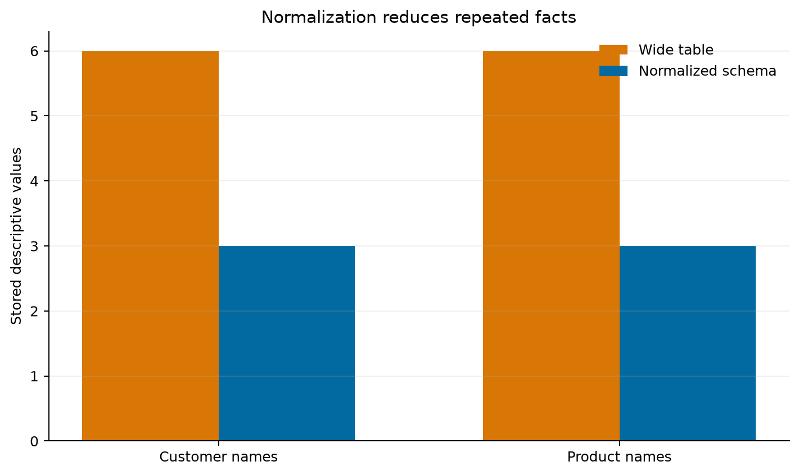

# Database Design and Normalization {#sec-database-design-normalization}

:::cdi-message
- **ID:** DBSQL-005
- **Type:** Core guide chapter
- **Audience:** Data practitioners designing or maintaining relational databases
- **Theme:** Structure data so that meaning, integrity, and change remain manageable
:::

## Learning objectives

By the end of this chapter, you will be able to:

1. translate business rules into entities, attributes, keys, and relationships;
2. distinguish candidate, primary, natural, surrogate, and foreign keys;
3. identify insertion, update, and deletion anomalies;
4. move a table through first, second, and third normal form;
5. enforce relational rules with SQL constraints; and
6. decide when normalization or deliberate denormalization is appropriate.

## Design begins with meaning

A database is not merely a collection of tables. It is an explicit model of a
domain. Before writing `CREATE TABLE`, state the rules that the database must
preserve.

Consider a small order system:

- a customer may place many orders;
- each order belongs to exactly one customer;
- an order contains one or more products;
- a product can occur in many orders;
- the price charged is recorded when the order is placed; and
- the quantity of each order line must be positive.

These rules reveal four entities: `customers`, `orders`, `products`, and
`order_items`. The last entity resolves the many-to-many relationship between
orders and products and stores facts that belong to that relationship.

```{mermaid}
erDiagram
    CUSTOMERS ||--o{ ORDERS : places
    ORDERS ||--|{ ORDER_ITEMS : contains
    PRODUCTS ||--o{ ORDER_ITEMS : appears_in
    CUSTOMERS {
        integer customer_id PK
        string customer_name
        string email UK
    }
    ORDERS {
        integer order_id PK
        date order_date
        integer customer_id FK
    }
    PRODUCTS {
        integer product_id PK
        string product_name
        decimal current_price
    }
    ORDER_ITEMS {
        integer order_id PK,FK
        integer product_id PK,FK
        integer quantity
        decimal unit_price
    }
```

## From requirements to relations

### Entities and attributes

An **entity** is a distinguishable thing about which the system stores facts.
An **attribute** describes an entity. Good attributes are atomic at the level
needed by the application, have a clear domain, and describe the key, the whole
key, and nothing but the key.

Avoid columns whose meaning changes by context, such as `value1`, or columns
that encode repeated groups, such as `product_1`, `product_2`, and `product_3`.
Those designs hide relationships in column names and impose an artificial
limit on the number of related records.

### Choosing keys

| Key type | Purpose | Order-system example |
|---|---|---|
| Candidate key | Uniquely identifies a row and could be primary | `customers.email` |
| Primary key | Selected identifier for a row | `orders.order_id` |
| Natural key | Has domain meaning | Email or product SKU |
| Surrogate key | System-generated, meaning-free identifier | Integer `customer_id` |
| Composite key | Uses multiple columns | `(order_id, product_id)` |
| Foreign key | References a key in another relation | `orders.customer_id` |

Surrogate keys make references compact and stable, but they do not replace
business uniqueness rules. If two customers cannot share an email address,
declare `UNIQUE (email)` even when `customer_id` is the primary key.

## Why one wide table fails

Suppose every order line is stored in one table:

```sql
CREATE TABLE order_lines_wide (
    order_id       INTEGER,
    order_date     TEXT,
    customer_id    INTEGER,
    customer_name  TEXT,
    customer_email TEXT,
    product_id     INTEGER,
    product_name   TEXT,
    quantity       INTEGER,
    unit_price     NUMERIC
);
```

This looks convenient because one row contains everything needed for a report.
However, customer and product facts repeat on every matching order line.
Repetition creates three classic anomalies.

- **Update anomaly:** changing a customer's email requires updating every order
  line for that customer. A missed row creates conflicting truths.
- **Insertion anomaly:** a product cannot be recorded until it appears in an
  order unless unrelated order columns accept meaningless null values.
- **Deletion anomaly:** deleting the only order containing a product may also
  remove the only stored description of that product.

The problem is not repetition alone. The deeper problem is that attributes in
the row depend on different determinants.

## Functional dependencies

A functional dependency `X → Y` means that a value of `X` determines exactly
one value of `Y`. For the wide order table:

```text
order_id                 → order_date, customer_id
customer_id              → customer_name, customer_email
product_id               → product_name, current product details
(order_id, product_id)   → quantity, unit_price
```

The logical row key is `(order_id, product_id)`, yet many attributes depend on
only one part of that key or on another non-key attribute. Normalization uses
these dependencies to separate facts by what determines them.

## The normalization sequence

### First normal form: one value per cell

A relation is in **first normal form (1NF)** when each row is uniquely
identifiable, every column contains values from one domain, and repeating
groups are represented as rows rather than numbered columns or lists.

Moving products from `product_1`, `product_2`, and `product_3` into separate
order-line rows reaches 1NF, but customer and product facts may still repeat.

### Second normal form: depend on the whole key

A relation is in **second normal form (2NF)** when it is in 1NF and every
non-key attribute depends on the entire candidate key. This matters when a key
has multiple columns.

In the wide table, `order_date` depends only on `order_id`, while
`product_name` depends only on `product_id`. Move order facts to `orders` and
product facts to `products`. Keep `quantity` and the price charged in
`order_items`, because they describe a particular product in a particular
order.

### Third normal form: no non-key intermediaries

A relation is in **third normal form (3NF)** when it is in 2NF and non-key
attributes do not depend transitively on a key through another non-key
attribute.

If `orders` stored `customer_id`, `customer_name`, and `customer_email`, then:

```text
order_id → customer_id → customer_name, customer_email
```

Move customer facts to `customers`; keep only `customer_id` as the reference in
`orders`. A customer change then occurs once and is visible through joins.

## Implementing the normalized schema

The accompanying SQL file creates the schema used in the practical:

```{.sql filename="scripts/sql/05-normalized-order-schema.sql"}
-- Four relations, each with one clear subject.
CREATE TABLE customers (
    customer_id   INTEGER PRIMARY KEY,
    customer_name TEXT NOT NULL,
    email         TEXT NOT NULL UNIQUE
);

CREATE TABLE products (
    product_id    INTEGER PRIMARY KEY,
    product_name  TEXT NOT NULL,
    current_price NUMERIC NOT NULL CHECK (current_price >= 0)
);

CREATE TABLE orders (
    order_id    INTEGER PRIMARY KEY,
    order_date  TEXT NOT NULL,
    customer_id INTEGER NOT NULL,
    FOREIGN KEY (customer_id) REFERENCES customers (customer_id)
);

CREATE TABLE order_items (
    order_id   INTEGER NOT NULL,
    product_id INTEGER NOT NULL,
    quantity   INTEGER NOT NULL CHECK (quantity > 0),
    unit_price NUMERIC NOT NULL CHECK (unit_price >= 0),
    PRIMARY KEY (order_id, product_id),
    FOREIGN KEY (order_id) REFERENCES orders (order_id) ON DELETE CASCADE,
    FOREIGN KEY (product_id) REFERENCES products (product_id)
);
```

`unit_price` deliberately appears in `order_items` while `current_price`
appears in `products`. They represent different facts: the historical price
charged and the product's current catalogue price. Normalization separates
facts by meaning; it does not remove every superficially similar value.

### Constraints are executable rules

| Constraint | Rule enforced |
|---|---|
| `PRIMARY KEY` | Every stored entity or relationship is uniquely identifiable |
| `FOREIGN KEY` | Referenced parents must exist |
| `NOT NULL` | Required facts cannot be omitted |
| `UNIQUE` | Candidate-key values cannot be duplicated |
| `CHECK` | Values must satisfy a row-level domain rule |

SQLite requires `PRAGMA foreign_keys = ON` for foreign-key enforcement on each
connection. Other database systems enable this behavior differently, so verify
the engine rather than assuming that declared constraints are active.

## Reconstructing useful views

Normalization optimizes the storage of facts, not necessarily the shape of an
analytical result. A join can reconstruct the familiar order-line view:

```sql
SELECT
    o.order_id,
    o.order_date,
    c.customer_name,
    p.product_name,
    oi.quantity,
    oi.unit_price,
    oi.quantity * oi.unit_price AS line_total
FROM orders AS o
JOIN customers AS c
  ON c.customer_id = o.customer_id
JOIN order_items AS oi
  ON oi.order_id = o.order_id
JOIN products AS p
  ON p.product_id = oi.product_id
ORDER BY o.order_id, p.product_id;
```

Tables provide a reliable source of truth; views and queries provide shapes
suited to applications and analysis.

## Practical: measure repetition and test integrity

Run the reproducible example from the repository root:

```bash
bash scripts/bash/05-run-normalization-demo.sh
```

The workflow:

1. creates equivalent wide and normalized SQLite designs in memory;
2. inserts the same business records into both designs;
3. calculates repeated customer and product values;
4. attempts invalid inserts to test the constraints;
5. verifies that joined normalized rows reproduce the wide-table totals; and
6. writes a CSV summary and comparison plot.

```{python}
#| echo: false
#| eval: false
#| fig-cap: "Repeated descriptive values in a wide table compared with the normalized schema."
from IPython.display import Image, display

display(Image(filename="results/figures/05-normalization-comparison.png"))
```

{#fig-normalization-comparison}

The number of rows is not expected to fall in every normalized design. The
important result is that each fact has one authoritative home and invalid
relationships are rejected before they become data-quality problems.

## When denormalization is justified

Normalization is the default for transactional systems because updates and
integrity matter. Deliberate denormalization can be appropriate for read-heavy
analytical systems, cached API responses, materialized views, or dimensional
models where predictable query performance is worth controlled redundancy.

Before denormalizing, document:

- the measured workload or performance problem;
- which fact will be duplicated;
- which source remains authoritative;
- how copies will be synchronized and tested; and
- how stale or conflicting values will be detected.

Denormalization should be an explicit performance decision, not an accidental
substitute for understanding the data model.

## Design review checklist

Before accepting a relational design, ask:

- Does every table represent one entity or relationship?
- Does every table have a declared primary key?
- Are business candidate keys protected with `UNIQUE` constraints?
- Do foreign keys match the relationship optionality and deletion policy?
- Are repeating groups represented as rows?
- Does every non-key attribute depend on the key, the whole key, and nothing
  but the key?
- Are historical facts distinguished from current reference values?
- Are domain rules enforced as close to storage as practical?
- Can common outputs be reconstructed without ambiguous joins?
- Is any redundancy intentional, measured, and governed?

## Exercises

1. Add a `categories` table and relate each product to one category. Identify
   the functional dependency that justifies the new relation.
2. Allow the same product to appear twice in one order with separate line
   numbers. Redesign the `order_items` key without losing integrity.
3. Decide whether deleting a customer with existing orders should be
   restricted, cascaded, or represented with a soft-delete status. Explain the
   audit implications.
4. Add shipping addresses. Determine whether an order should reference the
   customer's current address or preserve an order-time snapshot.
5. Extend the Python validation so that it tests duplicate emails and negative
   product prices as well as orphaned order items and zero quantities.

## Chapter summary

Relational design turns domain rules into durable structure. Functional
dependencies expose where unrelated facts have been combined. First normal
form removes repeating groups, second normal form removes partial dependencies,
and third normal form removes transitive dependencies. Keys and constraints
then make those design decisions executable. The result is not merely tidy
tables: it is a database in which each fact has a clear home, changes are safer,
and downstream queries can be trusted.
