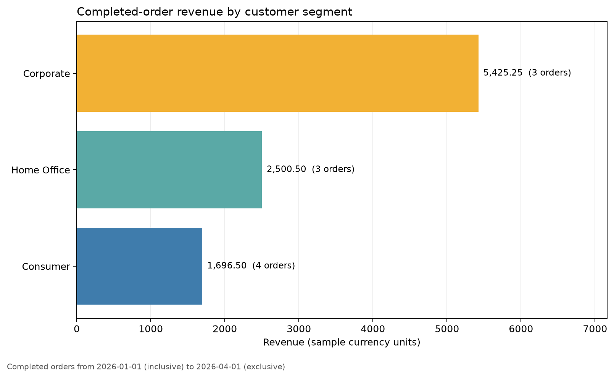

# SQL and Python Integration {#sec-sql-python-integration}

:::cdi-message
- **ID:** DSDP-006
- **Type:** Applied guide chapter
- **Audience:** Data analysts, data scientists, and aspiring data engineers
- **Theme:** Combining SQL's relational operations with Python's automation and analytical ecosystem
:::

## Learning objectives

By the end of this chapter, you will be able to:

1. explain the boundary between database work and Python work;
2. open and close database connections safely;
3. send parameterized SQL statements from Python;
4. load query results into pandas without duplicating SQL logic;
5. use transactions to keep multi-step writes consistent;
6. validate query outputs before downstream analysis; and
7. organize database code into a small, repeatable workflow.

## Why combine SQL and Python?

SQL and Python solve different parts of the same data problem. SQL is designed to filter, join, aggregate, and update relational data close to where it is stored. Python is well suited to orchestration, validation, statistical analysis, visualization, and integration with files, APIs, and machine-learning libraries.

A reliable workflow does not move every row into Python and then recreate database operations with dataframe code. Instead, it assigns work deliberately:

| Task | Preferred layer | Reason |
|---|---|---|
| Filter rows and columns | SQL | Reduces data transferred from the database |
| Join relational tables | SQL | Uses database keys and query optimization |
| Aggregate large tables | SQL | Computes close to storage |
| Control parameters and dates | Python | Supports reusable automation |
| Validate returned data | Python | Expressive checks and clear failures |
| Plot and model results | Python | Rich analytical ecosystem |
| Protect multi-step writes | Database transaction | Preserves consistency |

The key principle is simple: **use SQL to shape relational data and Python to control, validate, and extend the workflow**.

## Chapter case study

This chapter uses a small retail database with two tables:

- `customers`: one row per customer; and
- `orders`: one row per order, linked to `customers` by `customer_id`.

The workflow answers a practical question:

> Which customer segments generated the most completed-order revenue during a selected period?

The complete example is implemented in `scripts/python/06-sql-python-integration.py`. It reads deterministic records from `data/raw/06-customers.csv` and `data/raw/06-orders.csv`, creates a local SQLite database with `queries/06-create-retail-schema.sql`, executes `queries/06-segment-revenue.sql`, validates the result, writes a CSV summary, and generates a plot.

SQLite is used because it requires no separate database server. The same workflow structure applies to PostgreSQL, MySQL, SQL Server, and other database systems, although their drivers and connection settings differ.

## The Python database workflow

A database-enabled Python program usually follows six stages:

1. obtain connection settings;
2. connect to the database;
3. begin a transaction when writes must be atomic;
4. execute parameterized SQL;
5. validate and use the returned data; and
6. commit or roll back, then close the connection.

Keeping these stages visible makes failures easier to diagnose. A connection failure is different from an invalid query, and both are different from a valid query that returns unexpected data.

## Connecting safely

Python's standard-library `sqlite3` module implements the Python Database API specification. A context manager provides a clear connection boundary:

```{python}
#| eval: false
from pathlib import Path
import sqlite3

database_path = Path("data/processed/06-retail.db")
database_path.parent.mkdir(parents=True, exist_ok=True)

with sqlite3.connect(database_path) as connection:
    connection.execute("PRAGMA foreign_keys = ON")
    customer_count = connection.execute(
        "SELECT COUNT(*) FROM customers"
    ).fetchone()[0]
```

The `with` block gives the connection a limited lifetime and coordinates transaction handling. Explicitly enabling foreign-key enforcement is important in SQLite because foreign-key constraints are not automatically enforced by every connection.

For a server database, connection credentials should come from environment variables or a managed secret store—not from source code committed to Git.

```{python}
#| eval: false
import os

database_url = os.environ["DATABASE_URL"]
```

Avoid printing complete connection URLs because they may contain usernames, passwords, hostnames, or access tokens.

## Creating a schema from Python

Schema definitions can be executed from Python while remaining ordinary SQL:

```{python}
#| eval: false
connection.executescript(
    """
    CREATE TABLE IF NOT EXISTS customers (
        customer_id INTEGER PRIMARY KEY,
        customer_name TEXT NOT NULL,
        segment TEXT NOT NULL
            CHECK (segment IN ('Consumer', 'Corporate', 'Home Office'))
    );

    CREATE TABLE IF NOT EXISTS orders (
        order_id INTEGER PRIMARY KEY,
        customer_id INTEGER NOT NULL,
        order_date TEXT NOT NULL,
        status TEXT NOT NULL
            CHECK (status IN ('completed', 'pending', 'cancelled')),
        order_total REAL NOT NULL CHECK (order_total >= 0),
        FOREIGN KEY (customer_id) REFERENCES customers(customer_id)
    );
    """
)
```

`IF NOT EXISTS` prevents this teaching example from failing when rerun. In a production system, schema evolution should normally be managed with versioned migrations so every structural change is explicit and reviewable.

## Sending values safely with parameters

Never construct a query by inserting untrusted values into an SQL string:

```{python}
#| eval: false
# Unsafe: do not use
query = f"SELECT * FROM orders WHERE status = '{status}'"
```

String interpolation mixes SQL syntax with data. It can create quoting bugs and SQL-injection vulnerabilities. Use the parameter style required by the database driver:

```{python}
#| eval: false
query = "SELECT * FROM orders WHERE status = ?"
rows = connection.execute(query, (status,)).fetchall()
```

SQLite uses `?` placeholders. Other drivers may use `%s`, `:name`, or another documented style. Parameters represent **values**, not SQL identifiers. A table name or sort direction should be selected from a controlled allowlist rather than accepted directly from user input.

### Parameterizing a reporting period

The case-study query accepts start and end dates:

```{sql}
SELECT
    c.segment,
    COUNT(*) AS completed_orders,
    ROUND(SUM(o.order_total), 2) AS revenue,
    ROUND(AVG(o.order_total), 2) AS average_order_value
FROM orders AS o
JOIN customers AS c
  ON o.customer_id = c.customer_id
WHERE o.status = 'completed'
  AND o.order_date >= :start_date
  AND o.order_date < :end_date
GROUP BY c.segment
ORDER BY revenue DESC;
```

The query uses a half-open interval: `start_date <= order_date < end_date`. This convention composes cleanly across adjacent reporting windows and avoids ambiguity at the upper boundary.

## Reading SQL results into pandas

`pandas.read_sql_query()` turns a relational result into a dataframe:

```{python}
#| eval: false
import pandas as pd

summary = pd.read_sql_query(
    query,
    connection,
    params={
        "start_date": "2026-01-01",
        "end_date": "2026-04-01",
    },
)
```

The database still performs the join, filter, and aggregation. Python receives only the small summary needed for validation and plotting.

This is preferable to loading entire tables and joining them in pandas when:

- the database tables are large;
- indexes can accelerate the filter;
- database permissions restrict accessible columns or rows; or
- several applications need the same relational logic.

Pandas is appropriate after the query boundary when the result is small enough for memory and the next operation belongs to the analytical layer.

## Transactions and atomic writes

A transaction treats a related group of database statements as one unit. Either all statements succeed, or none of their effects remain.

Consider recording an order and its audit event. If the order is inserted but the audit insert fails, committing only the first statement would leave incomplete history. A transaction prevents that partial state.

```{python}
#| eval: false
try:
    with connection:
        connection.execute(
            """
            INSERT INTO orders
                (order_id, customer_id, order_date, status, order_total)
            VALUES (?, ?, ?, ?, ?)
            """,
            order_record,
        )
        connection.execute(
            """
            INSERT INTO order_events (order_id, event_type)
            VALUES (?, ?)
            """,
            (order_record[0], "created"),
        )
except sqlite3.IntegrityError as error:
    raise RuntimeError("Order write was rolled back") from error
```

The transaction boundary should match a business operation, not an arbitrary number of statements.

### Commit and rollback

- **Commit** makes all successful changes in the transaction durable.
- **Rollback** discards changes made since the transaction began.

Rollback is not merely error cleanup. It is part of the correctness model: downstream users should never observe half of an operation that was intended to be indivisible.

## Bulk inserts

Use `executemany()` for repeated inserts instead of issuing one separately managed transaction per row:

```{python}
#| eval: false
connection.executemany(
    """
    INSERT INTO customers (customer_id, customer_name, segment)
    VALUES (?, ?, ?)
    """,
    customer_records,
)
```

For very large loads, database-specific bulk-loading tools are usually faster. Regardless of method, validate row counts, required fields, key uniqueness, and rejected records.

## Validate at the boundary

A query can execute successfully and still return unsuitable data. Python should validate the contract expected by later steps.

```{python}
#| eval: false
required_columns = {
    "segment",
    "completed_orders",
    "revenue",
    "average_order_value",
}

missing_columns = required_columns.difference(summary.columns)
if missing_columns:
    raise ValueError(f"Missing columns: {sorted(missing_columns)}")

if summary.empty:
    raise ValueError("The reporting query returned no rows")

if summary["revenue"].lt(0).any():
    raise ValueError("Revenue cannot be negative")
```

Useful checks include:

- required columns are present;
- the result is not unexpectedly empty;
- identifiers are unique where required;
- numeric ranges are credible;
- dates are inside the requested window; and
- totals reconcile with a trusted control query.

Failing early with a precise message is safer than generating an attractive but incorrect chart.

## Keep SQL readable

Long SQL strings embedded throughout Python modules become hard to test and maintain. Use one of three patterns depending on project size:

1. short, single-purpose SQL constants in the Python module;
2. query functions that accept explicit parameters; or
3. separate `.sql` files for long, shared, or independently reviewed queries.

The chapter stores the query separately and wraps its execution in a function:

```{python}
#| eval: false
query_path = Path("queries/06-segment-revenue.sql")

def load_segment_revenue(connection, start_date, end_date):
    return pd.read_sql_query(
        query_path.read_text(encoding="utf-8"),
        connection,
        params={"start_date": start_date, "end_date": end_date},
    )
```

The function creates a narrow interface: callers provide dates and receive a dataframe. Connection management remains visible to the orchestration layer.

## A reproducible chapter workflow

Run the complete example from the repository root:

```{bash}
bash scripts/bash/06-run-sql-python-integration.sh
```

The wrapper uses the repository's `.venv` when available and otherwise uses `python3`. The Python script creates:

- `data/processed/06-retail.db` — local SQLite database;
- `results/06-segment-revenue.csv` — query result;
- `results/06-sql-python-summary.json` — validation and run metadata; and
- `results/figures/06-segment-revenue.png` — revenue comparison plot.

The complete reproducible inputs are also retained:

- `data/raw/06-customers.csv` and `data/raw/06-orders.csv` — source records;
- `queries/06-create-retail-schema.sql` — schema and index definition; and
- `queries/06-segment-revenue.sql` — parameterized reporting query.

The database is a reproducible generated artifact. The script removes and rebuilds only its chapter-specific database, which prevents old rows from changing the demonstration result.

## Interpreting the result

{#fig-segment-revenue}

Figure @fig-segment-revenue is based on the aggregated query result, not on entire raw tables loaded into Python. The labels show both revenue and completed-order counts, keeping the graphic connected to the relational calculation.

The plot answers the reporting question, but the workflow also produces machine-readable outputs. The CSV can be inspected or reused, while the JSON summary records the reporting window, database row counts, and reconciliation status.

## Reconciliation

An important validation is to compare the dataframe's total revenue with a separate control query:

```{python}
#| eval: false
control_total = connection.execute(
    """
    SELECT ROUND(SUM(order_total), 2)
    FROM orders
    WHERE status = 'completed'
      AND order_date >= ?
      AND order_date < ?
    """,
    (start_date, end_date),
).fetchone()[0]

reported_total = round(float(summary["revenue"].sum()), 2)
if reported_total != control_total:
    raise ValueError("Segment totals do not reconcile")
```

This check guards against accidental row loss or multiplication during joins. In real pipelines, reconciliations often compare source counts, target counts, monetary totals, or hashes across stages.

## Common failure modes

### Loading too much data

**Symptom:** Python uses excessive memory or takes a long time before analysis begins.

**Correction:** select only required columns, filter early, aggregate in SQL, or read results in chunks.

### Building SQL with string interpolation

**Symptom:** queries break on quotes or expose the application to SQL injection.

**Correction:** use driver-supported parameters for values and allowlists for identifiers.

### Leaving connections open

**Symptom:** the application exhausts database connections or retains locks.

**Correction:** use context managers and keep connection lifetimes deliberate.

### Treating successful execution as valid data

**Symptom:** downstream outputs are empty, duplicated, incomplete, or implausible even though no SQL error occurred.

**Correction:** validate schema, cardinality, ranges, and reconciliations immediately after querying.

### Committing partial business operations

**Symptom:** related tables disagree after one statement fails.

**Correction:** place related writes inside one transaction and verify rollback behavior.

### Hiding every operation behind one abstraction

**Symptom:** developers cannot see when connections begin, which query runs, or where transactions commit.

**Correction:** use small functions with explicit parameters and return types. Abstraction should clarify boundaries, not erase them.

## Extending to server databases

The case study uses SQLite, but a server database adds operational concerns:

- install the appropriate driver;
- obtain credentials securely;
- configure encrypted connections;
- use connection pooling for long-running applications;
- set connection and statement timeouts;
- understand the database's transaction isolation behavior; and
- log query names and durations without logging sensitive parameter values.

Libraries such as SQLAlchemy can provide a consistent connection and transaction interface across database systems. Even with an abstraction layer, understanding SQL, transactions, and driver parameters remains essential.

## Practice exercises

### Exercise 1: Add a region dimension

Add a `region` column to `customers`, update the sample records, and change the report to group by both `region` and `segment`.

### Exercise 2: Test an empty period

Run the reporting function for a date range with no completed orders. Decide whether an empty dataframe should be accepted, warned about, or treated as an error for this workflow.

### Exercise 3: Verify rollback

Inside one transaction, insert a valid order followed by an invalid order with a nonexistent `customer_id`. Confirm that neither row remains after the integrity error.

### Exercise 4: Add a query plan check

Create an index on `orders(order_date, status)` and use SQLite's `EXPLAIN QUERY PLAN` to examine whether the reporting query can use it.

### Exercise 5: Add another external query

Create `queries/06-customer-order-counts.sql`, load it with `Path.read_text()`, and produce a second validated report grouped by customer.

## Chapter checklist

Before considering a Python–SQL workflow complete, confirm that:

- [ ] connection settings are not hard-coded secrets;
- [ ] connections have a clear lifetime;
- [ ] SQL values use parameters;
- [ ] database operations occur at the appropriate layer;
- [ ] related writes share a transaction;
- [ ] query outputs are validated;
- [ ] important totals reconcile;
- [ ] generated files have stable repository paths; and
- [ ] the workflow can be rerun from a clean checkout.

## Key takeaways

SQL and Python are complementary. SQL expresses relational work close to the data, while Python coordinates parameters, checks contracts, and connects query results to the wider analytical ecosystem.

The most important habits are to parameterize values, manage connection and transaction boundaries explicitly, validate returned data, and keep the SQL–Python interface small. These habits turn an exploratory query into a reproducible component that can later become part of a data pipeline.
