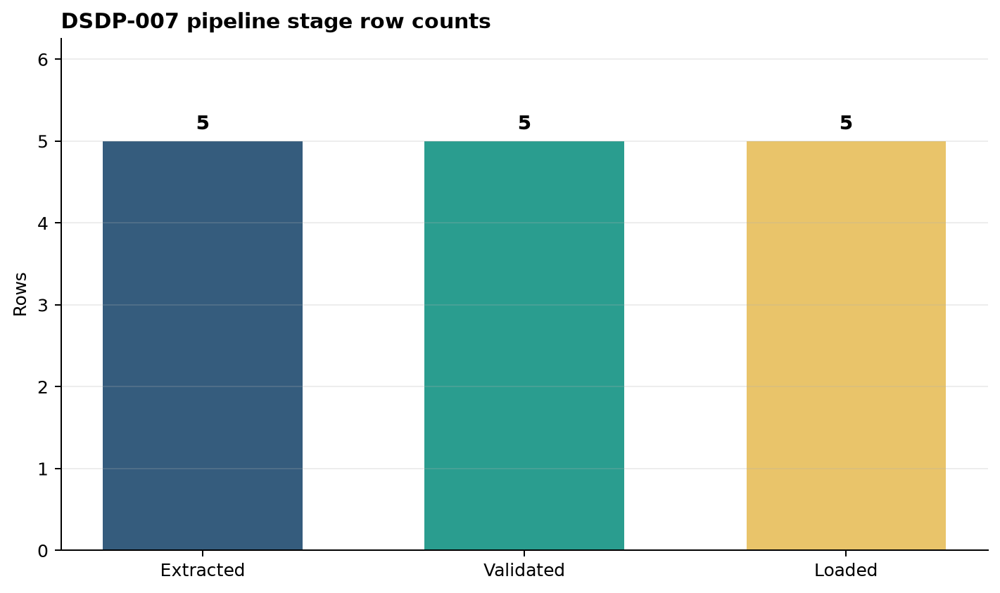

# From Scripts to Data Pipelines {#sec-from-scripts-to-data-pipelines}

::: {.cdi-message}
- **ID:** DSDP-007
- **Type:** Applied chapter
- **Audience:** Data analysts, data scientists, and aspiring data engineers
- **Theme:** Turning a working data script into a reliable, observable, and repeatable pipeline
:::

## Learning objectives

By the end of this chapter, you will be able to:

1. distinguish a one-off script from an operational data pipeline;
2. decompose data work into explicit extract, validate, transform, load, and report stages;
3. define contracts at pipeline boundaries;
4. make a pipeline idempotent and safe to rerun;
5. record run metadata, row counts, quality checks, and failures;
6. execute and inspect a small Python pipeline from the command line; and
7. identify the point at which scheduling and orchestration become necessary.

## A working script is not yet a pipeline

A script is a sequence of instructions. A data pipeline is a managed flow of data with explicit inputs, outputs, expectations, and operational evidence.

An exploratory script may be perfectly useful while its author is present. It often assumes that a file exists, column names have not changed, values are valid, and overwriting an output is harmless. A pipeline must make those assumptions visible and test them every time it runs.

| Concern | One-off script | Reliable pipeline |
|---|---|---|
| Input | Implicit filename | Declared source and schema |
| Processing | One continuous block | Named, testable stages |
| Failure | Traceback inspected manually | Clear failure state and diagnostics |
| Output | Written wherever convenient | Stable destination and contract |
| Reruns | May duplicate or corrupt data | Idempotent for the same input |
| Evidence | Console messages | Structured run metadata and metrics |
| Operation | Started manually | Ready for scheduling and orchestration |

The transformation logic can be identical in both forms. The difference is the operational structure around it.

## The pipeline boundary

This chapter uses a small order-processing pipeline. A CSV source contains order records. The pipeline validates the schema and business rules, derives revenue, writes a curated table, and records a run report.

The logical flow is:

```{mermaid}
flowchart TD
    A[Extract CSV] --> B[Validate contract]
    B --> C[Transform records]
    C --> D[Load curated CSV]
    D --> E[Record metrics]
```

Each arrow is a boundary. At every boundary, ask:

- What data enters?
- What guarantees must hold?
- What artifact leaves?
- What evidence proves the stage completed?
- What happens if the stage is attempted again?

These questions turn hidden assumptions into a pipeline contract.

## Separate configuration from logic

Hard-coded paths make a script difficult to run in another environment. The companion implementation accepts paths and a run date as command-line arguments:

```bash
python scripts/python/07-build-reliable-pipeline.py \
  --input data/raw/07-orders.csv \
  --output data/processed/07-orders-curated.csv \
  --report results/07-pipeline-run-report.json \
  --figure results/figures/07-pipeline-stage-row-counts.png \
  --run-date 2026-08-05
```

Configuration states *what changes between runs*. Functions contain *how each stage works*. This separation makes local execution, testing, automation, and later orchestration much simpler.

## Extract: read without silently changing meaning

Extraction brings source data into the pipeline boundary. At this stage, preserve the source representation and fail clearly when the source is missing.

```python
def extract(input_path: Path) -> pd.DataFrame:
    if not input_path.exists():
        raise FileNotFoundError(f"Input file not found: {input_path}")
    return pd.read_csv(input_path)
```

Extraction is not limited to files. Later chapters extend the same boundary to databases, APIs, object storage, and event streams. Regardless of the source, extraction should not disguise missing data or connectivity failures as an empty successful run.

## Validate: enforce the data contract

A data contract describes the minimum conditions under which downstream logic is meaningful. For the order data, the required columns are:

```python
REQUIRED_COLUMNS = {
    "order_id",
    "order_date",
    "customer_id",
    "product",
    "quantity",
    "unit_price",
}
```

Schema presence is only the first layer. The example also checks that identifiers are populated, order identifiers are unique, dates parse successfully, quantities are positive integers, and prices are non-negative.

Validation should fail before loading invalid output. This is preferable to allowing a malformed record to become a trusted table and discovering it later in a dashboard or model.

::: {.callout-warning}
## Do not confuse dropping records with validation

Silently removing invalid rows may make a run appear successful while hiding a source-system problem. Reject invalid input unless the pipeline has an explicit quarantine policy, an agreed threshold, and a traceable reason for every excluded record.
:::

## Transform: keep business logic explicit

Transformation converts valid source records into the target model. The example standardizes data types and derives revenue:

```python
orders["order_date"] = pd.to_datetime(orders["order_date"]).dt.date
orders["quantity"] = orders["quantity"].astype("int64")
orders["unit_price"] = orders["unit_price"].astype("float64")
orders["revenue"] = orders["quantity"] * orders["unit_price"]
orders["pipeline_run_date"] = run_date.isoformat()
```

Good transformation code is deterministic: the same validated input and configuration produce the same business values. A processing timestamp may differ between runs, but it should be metadata rather than part of the business calculation.

## Load: publish safely

The load stage writes curated data to its destination. A direct write can leave a partial file if execution stops halfway through. The example writes to a temporary file in the destination directory and then replaces the target:

```python
temporary_path = output_path.with_suffix(output_path.suffix + ".tmp")
orders.to_csv(temporary_path, index=False)
temporary_path.replace(output_path)
```

Replacement gives this file-based pipeline an important property: readers see either the previous complete output or the new complete output. They do not see a half-written table.

Database loads use the same principle with transactions, staging tables, merges, or partition replacement.

## Idempotency: make reruns safe

An idempotent pipeline produces the intended state even when the same logical run is repeated. This matters because failures, network timeouts, deployment retries, and backfills all cause reruns.

In this chapter, idempotency comes from:

- deterministic transformations;
- one row per unique `order_id`;
- replacement of the named output rather than blind appending; and
- a stable logical `run_date` supplied as configuration.

Appending every run would duplicate the orders. Replacing the complete curated snapshot makes the file safe to regenerate.

Idempotency depends on the load model. Common strategies include:

| Load model | Idempotent strategy |
|---|---|
| Full snapshot | Replace the target atomically |
| Incremental table | Merge using a stable business key |
| Date partition | Replace the affected partition |
| Event stream | Deduplicate using an event identifier |

## Observability: leave evidence behind

Console output is helpful to a person watching a run, but it is not enough for unattended execution. The example writes a JSON report containing:

- a unique run identifier;
- logical run date;
- start and finish timestamps in UTC;
- status and duration;
- input and output paths;
- source and output row counts;
- duplicate and invalid-row counts;
- total revenue; and
- a checksum of the input file.

The checksum ties the report to the exact input bytes. If two runs use different source content under the same filename, their checksums reveal the difference.

The generated stage-count figure provides a compact visual check.

{#fig-pipeline-stage-row-counts fig-alt="Bar chart comparing row counts at extract, validation, and load stages."}

The bars are expected to remain equal because this pipeline rejects invalid input rather than filtering it. A lower load count would therefore signal either a defect or an unapproved change in policy.

## Handle failures as pipeline outcomes

A failed run is not the absence of a result; it is an operational outcome that must be recorded. The companion script catches the exception at the pipeline boundary, writes a failed report with the error type and message, and exits with a non-zero status.

This behavior supports both humans and automation:

- a developer can inspect the report;
- a shell or CI job can detect the exit code;
- a scheduler can mark the task as failed; and
- an alerting system can use the structured error details.

The individual stage functions do not suppress exceptions. They add clear validation messages and allow the pipeline boundary to decide how the run is reported.

## Run the complete example

The Bash wrapper creates a deterministic sample input and executes the pipeline:

```bash
bash scripts/bash/07-run-pipeline.sh
```

Expected terminal output resembles:

```text
[PASS] Pipeline completed
[PASS] Curated data: data/processed/07-orders-curated.csv
[PASS] Run report: results/07-pipeline-run-report.json
[PASS] Figure: results/figures/07-pipeline-stage-row-counts.png
```

After running it, inspect the artifacts:

```bash
column -s, -t < data/processed/07-orders-curated.csv
python -m json.tool results/07-pipeline-run-report.json
```

Run the wrapper a second time. The curated table still contains five orders rather than ten. That simple test demonstrates the chosen idempotent load behavior.

## Test each layer

Pipeline testing should mirror the pipeline structure:

1. **Unit tests** exercise validation and transformation rules with small in-memory tables.
2. **Contract tests** verify source columns, types, constraints, and target shape.
3. **Integration tests** execute multiple stages using temporary input and output locations.
4. **End-to-end tests** run the command as an operator or scheduler would run it.

Useful assertions for this example include:

```python
assert curated["order_id"].is_unique
assert (curated["revenue"] >= 0).all()
assert len(curated) == report["metrics"]["output_rows"]
assert report["status"] == "success"
```

Tests should cover failure paths too: a missing column, duplicate identifier, invalid date, negative quantity, and unwritable destination.

## When does a pipeline need orchestration?

This pipeline is executable and observable, but it still has only one command and one source. A simple scheduled shell command may be sufficient at this scale.

Orchestration becomes valuable when the workflow needs several dependent tasks, retries with policies, parallel execution, backfills, centralized run history, credentials, or coordination across systems. Orchestration does not repair unclear boundaries or non-idempotent logic. Those foundations must be established first.

The progression is therefore:

```{mermaid}
flowchart LR
    A[Working script] --> B[Structured pipeline]
    B --> C[Scheduled pipeline]
    C --> D[Orchestrated workflow]
```

This chapter establishes the structured-pipeline layer. Later chapters add production sources, storage choices, orchestration, monitoring, recovery, and backfills.

## Design checklist

Before treating a script as a pipeline, confirm that:

- inputs, outputs, and configuration are explicit;
- stages have clear responsibilities;
- schema and business rules are validated;
- failures stop publication of invalid data;
- rerunning the same logical work is safe;
- output publication avoids partial state;
- row counts and relevant quality metrics are recorded;
- run timestamps and a run identifier are available;
- the process returns a meaningful exit status; and
- the command can run without editing source code.

## Chapter summary

A pipeline is more than transformation code. It is a repeatable data movement process surrounded by contracts, validation, safe publication, idempotency, and operational evidence. By separating extract, validate, transform, load, and report responsibilities, the example becomes easier to test locally and ready to be scheduled later.

The next chapter develops these ideas into a continuous case study and pipeline architecture, showing how components and responsibilities fit together across a larger system.

## Exercises

1. Add a `country` column and reject values outside an allowed set.
2. Add a quality metric for the number of distinct customers.
3. Change the load model from a full snapshot to an incremental merge keyed by `order_id`.
4. Introduce one duplicate order and confirm that the run fails without replacing the previous curated output.
5. Write tests for one successful run and three validation failures.
6. Explain which run-report fields you would use in an alert and which belong in a monitoring dashboard.

