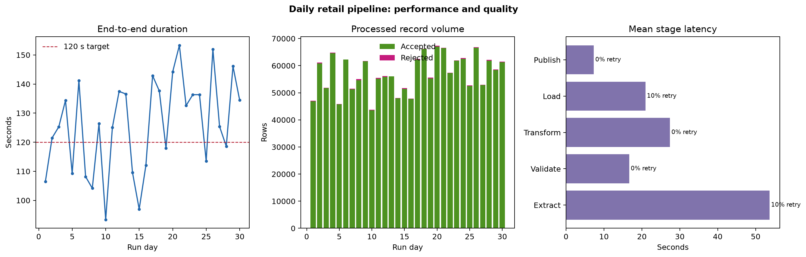

# Pipeline Case Study and Architecture {#sec-pipeline-case-study-and-architecture}

:::cdi-message
- **ID:** DBSQL-008
- **Type:** Case study and architecture
- **Audience:** Data analysts, analytics engineers, and aspiring data engineers
- **Theme:** Designing a reliable, observable, and restartable data pipeline
:::

## Learning objectives

By the end of this chapter, you will be able to:

1. translate a reporting requirement into a layered data-pipeline architecture;
2. distinguish source, landing, staging, warehouse, and serving responsibilities;
3. define contracts, quality gates, checkpoints, and operational metadata;
4. explain why idempotency and incremental processing matter; and
5. evaluate pipeline performance with latency, throughput, quality, and reliability measures.

## Case study: daily retail operations

Imagine a retailer that receives orders from an operational PostgreSQL database, product updates from a supplier CSV file, and store metadata from a small REST API. Managers need a trustworthy daily dashboard showing revenue, order volume, average order value, and fulfilment performance by store and product category.

The first implementation could be one script that queries each source, joins the data, and writes a report. That is useful for proving the logic, but it hides important production questions:

- What data was processed, and when?
- What happens if the API succeeds but the database extraction fails?
- Can a failed run restart without duplicating rows?
- How are late-arriving orders handled?
- How does the team know that a supplier changed a column name?
- Can dashboard users trace a number back to its source?

The case study therefore treats the pipeline as a system, not merely a sequence of SQL statements.

## Requirements and service expectations

The business requirement is translated into explicit operating targets.

| Requirement | Working target | Design implication |
|---|---:|---|
| Dashboard freshness | Available by 06:00 daily | Scheduled batch with a completion deadline |
| Historical correction | Reprocess any date | Partitioned data and parameterized backfills |
| Duplicate tolerance | Zero duplicated order keys | Idempotent merge on the business key |
| Data completeness | At least 99.5% of expected orders | Volume and reconciliation checks |
| Recovery objective | Resume within 30 minutes | Durable checkpoints and bounded retries |
| Auditability | Every published row traceable | Run IDs, timestamps, source metadata, and logs |

Targets make architectural trade-offs testable. A pipeline is not reliable simply because it completed once.

## Reference architecture

```{mermaid}
flowchart TD
    A["Operational sources"] --> B["Landing zone"]
    B --> C["Validated staging"]
    C --> D["Warehouse models"]
    D --> E["Serving layer"]
    F["Orchestrator and metadata"] -. controls and observes .-> B
    F -. controls and observes .-> C
    F -. controls and observes .-> D
    F -. controls and observes .-> E
```

Each layer has one primary responsibility:

- **Operational sources** own business transactions and reference data. The analytical pipeline should minimize its impact on these systems.
- **Landing** preserves extracted data with minimal transformation. It provides replayability and an evidence trail.
- **Validated staging** standardizes types, names, timestamps, and keys while quarantining invalid records.
- **Warehouse models** express stable business entities and metrics using relational transformations.
- **Serving** publishes tables optimized for dashboards, applications, or downstream analysis.
- **Orchestration and metadata** coordinate dependencies and record run state, quality results, lineage, and timing.

Separating layers prevents source-specific extraction details from leaking into every analytical query.

## Data flow and contracts

### Source contracts

A source contract records the assumptions the pipeline makes about incoming data. For `orders`, the contract might require:

| Field | Type | Rule |
|---|---|---|
| `order_id` | string | Non-null and unique within the source |
| `store_id` | string | Non-null; must resolve to a known store |
| `ordered_at` | timestamp | Valid UTC timestamp |
| `quantity` | integer | Greater than zero |
| `unit_price` | decimal | Greater than or equal to zero |
| `updated_at` | timestamp | Used as the incremental cursor |

Contracts should be versioned. An added nullable field may be compatible, while renaming `order_id` is a breaking change that should stop publication.

### Incremental extraction

Extracting every historical row each day is simple but becomes expensive. The case study uses a high-water mark based on `updated_at`:

```sql
SELECT *
FROM orders
WHERE updated_at > :previous_watermark
  AND updated_at <= :current_watermark;
```

The upper bound is fixed at the start of the run. This creates a reproducible interval and prevents an extraction from chasing continuously arriving records. A small look-back window can capture delayed commits; the loading step must then deduplicate by `order_id` and retain the newest `updated_at` value.

### Idempotent loading

An idempotent task produces the same target state when repeated with the same input. The warehouse load uses an upsert rather than an unconditional append:

```sql
INSERT INTO fact_orders AS target (
    order_id, store_key, product_key, ordered_at, quantity, unit_price, run_id
)
SELECT
    order_id, store_key, product_key, ordered_at, quantity, unit_price, :run_id
FROM stg_orders
ON CONFLICT (order_id) DO UPDATE SET
    store_key = EXCLUDED.store_key,
    product_key = EXCLUDED.product_key,
    ordered_at = EXCLUDED.ordered_at,
    quantity = EXCLUDED.quantity,
    unit_price = EXCLUDED.unit_price,
    run_id = EXCLUDED.run_id;
```

The database constraint on `order_id` is part of the correctness mechanism—not merely a performance detail.

## Pipeline stages

The end-to-end run is divided into independently observable stages.

1. **Initialize the run.** Create a unique `run_id`, capture configuration, and select the watermark interval.
2. **Extract sources.** Read orders, products, and stores into immutable landing partitions.
3. **Validate inputs.** Check schema, required values, uniqueness, ranges, and referential coverage.
4. **Transform staging data.** Normalize timestamps, currencies, codes, and data types.
5. **Load warehouse tables.** Merge dimensions before facts inside controlled transactions.
6. **Build serving models.** Aggregate daily store and category measures.
7. **Reconcile and publish.** Compare counts and totals, then atomically expose the new partition.
8. **Close the run.** Persist status, row counts, quality outcomes, timings, and the new watermark.

Publication occurs only after mandatory checks pass. This prevents a technically successful transformation from exposing incomplete data.

## Failure boundaries and recovery

Retries are appropriate for transient failures such as network timeouts, rate limits, and temporary database unavailability. They are inappropriate for deterministic defects such as a missing required column or invalid SQL.

| Failure | Classification | Response |
|---|---|---|
| API timeout | Transient | Retry with exponential backoff and jitter |
| Database authentication rejected | Configuration | Stop and alert; do not repeatedly retry |
| Required column missing | Contract | Quarantine input, stop publication, alert owner |
| Invalid records below threshold | Data quality | Quarantine rows and continue with recorded warning |
| Reconciliation mismatch | Correctness | Fail before publication and preserve diagnostics |
| Dashboard refresh failure | Downstream | Preserve warehouse commit and retry refresh separately |

Durable checkpoints allow recovery to begin at the earliest safe stage. A checkpoint is valid only when the output is complete, validated, and addressable by `run_id` or partition.

## Operational metadata

A minimal `pipeline_runs` table can answer whether a run is active, successful, failed, or superseded.

```sql
CREATE TABLE pipeline_runs (
    run_id UUID PRIMARY KEY,
    pipeline_name TEXT NOT NULL,
    interval_start TIMESTAMPTZ NOT NULL,
    interval_end TIMESTAMPTZ NOT NULL,
    started_at TIMESTAMPTZ NOT NULL,
    finished_at TIMESTAMPTZ,
    status TEXT NOT NULL,
    input_rows BIGINT DEFAULT 0,
    published_rows BIGINT DEFAULT 0,
    rejected_rows BIGINT DEFAULT 0,
    error_message TEXT
);
```

Task-level metadata should also capture attempt number, duration, input and output locations, query or code version, and quality-check results. Logs explain individual events; metadata explains the run as a whole.

## Simulating the architecture

The companion script `scripts/python/08-simulate-pipeline-architecture.py` models 30 daily runs across five stages. It introduces realistic variation in record volume, processing rates, and transient failures. Failed transient attempts are retried up to two times.

Run it from the repository root:

```bash
bash scripts/bash/08-run-pipeline-case-study.sh
```

The simulation writes:

- `results/08-pipeline-run-summary.csv`, one row per run;
- `results/08-pipeline-stage-summary.csv`, aggregate stage measures;
- `results/08-pipeline-case-study.json`, headline indicators; and
- `results/figures/08-pipeline-architecture-performance.png`, the performance plot.

{fig-alt="Three-panel pipeline performance plot showing daily duration, accepted versus rejected records, and stage latency and retry rate."}

The plot links architecture to observable outcomes. End-to-end duration identifies freshness risk; accepted and rejected volumes expose quality changes; stage latency and retry rate identify the component responsible for instability.

## Evaluating the system

The most useful measures answer different questions:

| Measure | Question answered |
|---|---|
| Freshness | How old is the newest published data? |
| End-to-end duration | Can the pipeline meet its delivery deadline? |
| Throughput | How many records are processed per unit time? |
| Acceptance rate | What proportion of records passed validation? |
| Reconciliation difference | Do source and target totals agree? |
| Retry rate | Which dependencies are intermittently unstable? |
| Success rate | How often does the complete pipeline publish valid data? |

No single measure proves reliability. For example, a fast run that silently drops 10% of orders is worse than a slower run that fails visibly before publication.

## Architecture decisions and trade-offs

### Batch versus streaming

The daily dashboard does not require second-level freshness, so batch processing is the simplest design that meets the requirement. Streaming would add state management, event-time semantics, and continuous operations without a corresponding business benefit. If fraud decisions later require events within seconds, that workload should receive a separate streaming path.

### Full refresh versus incremental processing

Full refreshes are easier to reason about and remain useful for small dimensions and recovery. Incremental extraction reduces routine cost for the growing orders table. The design deliberately supports both incremental daily runs and partition-based backfills.

### Database transformations versus Python

Set-based joins, filters, aggregations, and constraints remain in SQL, close to warehouse data. Python coordinates extraction, API interaction, contract validation, and operational control. The boundary is based on responsibility rather than language preference.

## Practical review checklist

Before approving a pipeline design, confirm that:

- every source and published dataset has an owner and a contract;
- incremental boundaries are explicit and reproducible;
- writes are idempotent and protected by database constraints;
- raw inputs or equivalent replay points are retained;
- mandatory quality and reconciliation checks block publication;
- retries are bounded and limited to transient failures;
- checkpoints represent complete, validated outputs;
- backfills cannot overwrite unrelated partitions;
- secrets are external to code and logs;
- run and task metadata support diagnosis and audit; and
- freshness, volume, quality, duration, and failure alerts have owners.

## Key takeaways

- A production pipeline is a coordinated data system with contracts, state, recovery, and observability.
- Layered storage separates replayable source data from validated, modeled, and published data.
- Fixed incremental intervals, durable checkpoints, and idempotent writes make reruns safe.
- Data quality gates and reconciliation protect users from plausible but incorrect outputs.
- Architecture should be driven by service expectations; daily batch is preferable when it satisfies the actual freshness requirement.
- Metrics must cover timeliness, correctness, volume, and component reliability—not only whether a job exited successfully.

## What comes next

This chapter established the continuous case study and its reference architecture. The next chapter examines data sources and ingestion in greater depth, including source-system constraints, file and API ingestion, schema evolution, and safe landing patterns.

