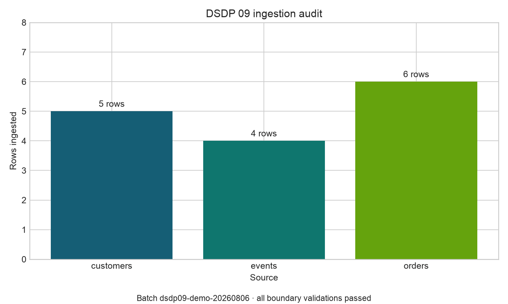

# Data Sources and Ingestion {#sec-data-sources-and-ingestion}

::: cdi-message
- **ID:** DSDP-009
- **Type:** Guide chapter
- **Audience:** Data analysts, data scientists, and beginning data engineers
- **Theme:** Designing observable, repeatable ingestion across files, APIs, and databases
:::

## Learning objectives

By the end of this chapter, you will be able to:

1. distinguish sources, ingestion methods, and storage destinations;
2. choose between batch, micro-batch, and streaming ingestion;
3. ingest tabular files, API-style JSON, and relational data with Python;
4. preserve raw data while attaching operational metadata;
5. validate schema, row counts, uniqueness, and freshness at the ingestion boundary; and
6. make reruns safe through deterministic naming and idempotent writes.

## Ingestion is a boundary, not a copy command

Ingestion moves data from a source system into a controlled data environment. A reliable ingestion step also records *what* arrived, *when* it arrived, *where* it came from, and whether it satisfies the minimum contract required by downstream work.

A source is the system that owns or publishes the data. A transport is the mechanism used to retrieve it. A landing zone is the first controlled destination. These concepts should remain separate: the same source may be reached through an API today and a scheduled export tomorrow.

| Source | Common transport | Typical risk | Useful boundary check |
|---|---|---|---|
| CSV or spreadsheet export | File transfer or object storage | Delimiter, encoding, partial upload | Header, size, checksum, row count |
| REST API | HTTPS and JSON | Pagination, rate limits, schema drift | Status, page count, required keys |
| Relational database | SQL connection | Mutable rows, load on source | Watermark, query bounds, key uniqueness |
| Event stream | Broker or log | Duplicates, ordering, late events | Event ID, event time, offset |

## Batch, micro-batch, and streaming

The ingestion mode should follow the business latency requirement rather than fashion.

- **Batch** processes a bounded collection on a schedule. It is easier to test, replay, and audit.
- **Micro-batch** processes small bounded collections frequently, often every few minutes.
- **Streaming** processes an unbounded event flow and requires explicit handling of event time, late arrival, ordering, and delivery semantics.

If a daily decision is acceptable, a daily batch is usually the clearest design. Streaming is justified when the value of the data declines quickly enough to offset its operational complexity.

## The raw landing principle

The first controlled copy should preserve source fidelity. Avoid silently cleaning names, converting units, dropping records, or filling missing values during extraction. Those are transformations and should be visible in a later stage.

Add metadata without rewriting source meaning. Common fields include:

- `ingested_at_utc`: when the pipeline accepted the record;
- `source_system`: stable source identifier;
- `source_object`: endpoint, table, or filename;
- `batch_id`: identifier shared by one bounded ingestion run; and
- `source_record_id`: stable key used for deduplication.

The raw layer is therefore immutable in intent: corrections normally arrive as new batches, while the original evidence remains available for replay and audit.

## A reproducible multi-source ingestion

The companion script creates three small source fixtures and ingests them into a common raw landing area:

1. customer records from CSV;
2. support events from API-style paginated JSON; and
3. orders from SQLite.

Run it from the repository root:

```bash
python scripts/python/09-ingest-data-sources.py
```

The example is offline and deterministic. In production, replace fixture creation with the real retrieval client while retaining the same boundary checks, metadata, and audit contract.

### File ingestion

A file should be treated as an object with identity, not merely as rows. Record its path, byte size, and cryptographic checksum before parsing. A checksum detects a changed file even when its name is unchanged.

```python
customers = pd.read_csv(csv_path, dtype={"customer_id": "string"})
require_columns(customers, {"customer_id", "segment", "country"}, "customers")
require_unique(customers, "customer_id", "customers")
```

Explicit identifier types prevent values such as leading zeros from being lost.

### API-style ingestion

Real APIs commonly paginate. The stopping rule must be explicit: follow a server-provided next token or stop only after a terminal page. Persist the request window or cursor so that a retry retrieves the same logical slice.

```python
records = [item for page in pages for item in page["items"]]
events = pd.json_normalize(records)
require_columns(events, {"event_id", "customer_id", "occurred_at"}, "events")
```

Production clients should also use timeouts, bounded retries with backoff, rate-limit handling, and safe secret management. Never log access tokens.

### Database ingestion

Avoid unbounded `SELECT *` extraction from operational systems. Select required columns and constrain incremental reads with a watermark such as `updated_at` plus a deterministic tie-breaker key.

```sql
SELECT order_id, customer_id, amount, status, updated_at
FROM orders
WHERE updated_at > ?
ORDER BY updated_at, order_id
```

Store the new watermark only after the landed batch and its audit record are committed successfully. Advancing it earlier can create a permanent gap.

## Boundary validation

Validation at ingestion should answer four immediate questions.

1. **Structure:** Are required columns present and parseable?
2. **Identity:** Are record keys non-null and unique within the declared grain?
3. **Volume:** Is the row count plausible relative to an expected range or recent history?
4. **Freshness:** Is the newest source timestamp recent enough for the use case?

The example fails fast on missing columns, null keys, duplicates, empty inputs, and invalid timestamps. It writes one audit row per source with the batch ID, checksum, row count, status, and timing.

```{=html}
<figure>
  
  <figcaption>Ingestion audit summary generated by the companion script.</figcaption>
</figure>
```

The machine-readable companion is `results/09-ingestion-audit.csv`. Operational dashboards should track these metrics across many runs rather than interpret a single batch in isolation.

## Idempotency and replay

An idempotent ingestion produces the same controlled result when the same batch is retried. Useful practices include:

- derive a batch ID from the source identity and extraction window;
- land each batch at a deterministic path;
- write to a temporary object and publish atomically;
- reject or safely replace an already-complete batch;
- deduplicate with stable source keys; and
- update checkpoints only after successful publication.

The companion script uses deterministic source fixtures and overwrites deterministic demonstration outputs. A production object store commonly uses partitioned paths such as:

```text
data/raw/orders/ingestion_date=2026-08-06/batch_id=<id>/orders.csv
```

Partition values support discovery and pruning, but the manifest or catalog remains the authoritative record of completed batches.

## Failure handling

Do not publish a partially downloaded or partially validated batch as successful. A robust control flow is:

1. retrieve into a temporary location;
2. calculate source and retrieval metadata;
3. parse and validate the bounded batch;
4. publish the landed object atomically;
5. record the successful audit entry; and
6. advance the source checkpoint.

Failures should retain enough context for diagnosis—source, batch, attempt, exception class, and stage—without exposing credentials or sensitive row values.

## Design checklist

Before implementing an ingestion connector, document:

- source owner and access method;
- expected schema and record grain;
- extraction window and latency target;
- pagination or incremental cursor rules;
- key, duplicate, volume, and freshness checks;
- raw destination and partition strategy;
- retry, timeout, and rate-limit behavior;
- secret and sensitive-data controls;
- checkpoint commit rule; and
- replay and backfill procedure.

## Exercises

1. Add a fourth source containing product data in JSON Lines format and extend the audit output.
2. Introduce a duplicate `event_id`. Confirm that the run fails before publishing the event landing file.
3. Replace the full order query with a stored watermark and run two incremental batches.
4. Add minimum and maximum expected row counts for each source.
5. Design a quarantine path for structurally valid rows that violate a business rule.

## Key takeaways

- Reliable ingestion establishes an observable contract at the boundary of the data platform.
- Preserve source fidelity in the raw layer and separate extraction from transformation.
- Choose the simplest ingestion mode that meets the required decision latency.
- Validate structure, identity, volume, and freshness before publishing a batch.
- Deterministic batch identity, atomic publication, and checkpoint discipline make retries and replay safe.

## What comes next

This chapter established how data enters the platform. The next chapter develops extraction patterns for external APIs, including pagination, retries, rate limits, incremental windows, and resilient client design.
