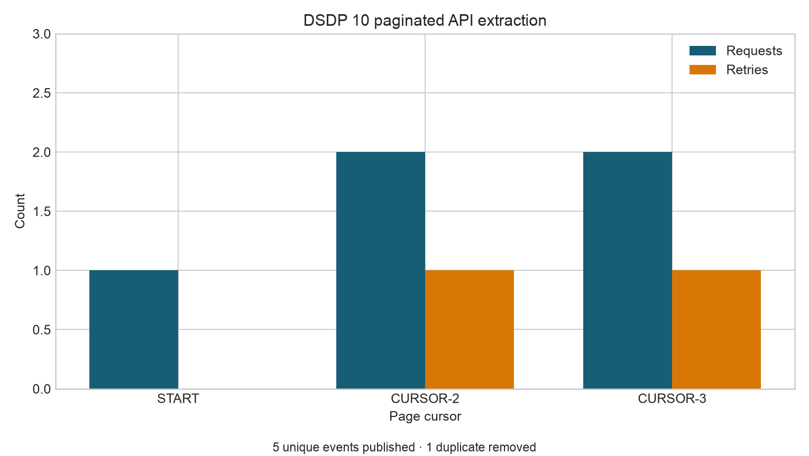

# Extraction Patterns and APIs {#sec-extraction-patterns-and-apis}

::: cdi-message
- **ID:** DSDP-010
- **Type:** Guide chapter
- **Audience:** Data analysts, data scientists, and beginning data engineers
- **Theme:** Building resilient, incremental, and observable API extraction clients
:::

## Learning objectives

By the end of this chapter, you will be able to:

1. separate API transport concerns from extraction and publication logic;
2. implement explicit pagination without skipping or repeating pages;
3. use timeouts and bounded exponential backoff for retryable failures;
4. respond safely to rate-limit signals;
5. define half-open incremental extraction windows;
6. commit checkpoints only after successful publication; and
7. record extraction metrics that support diagnosis and replay.

## Extraction is a protocol

An API extraction is not a single `GET` request. It is a protocol between a client and a changing external system. The client must define how requests are bounded, how pages are discovered, which failures are retryable, when a run is complete, and what evidence is retained.

A useful separation is:

| Layer | Responsibility | Example |
|---|---|---|
| Transport | Authentication, timeout, HTTP status, retries | `GET /v1/events` with a 30-second timeout |
| Pagination | Discover and request every page exactly once | Follow `next_cursor` until it is null |
| Extraction | Bound the logical records requested | `updated_at >= start` and `updated_at < end` |
| Validation | Check the returned contract | Required keys, unique IDs, valid timestamps |
| Publication | Atomically expose a complete batch | Replace a temporary file after validation |
| State | Remember only committed progress | Save `window_end` after publication succeeds |

Keeping these layers distinct makes the client easier to test. A fake transport can exercise pagination and retry logic without contacting the real service.

## Read the API contract first

Before writing a client, identify:

- the base URL, resource path, and supported API version;
- the authentication method and credential rotation policy;
- request and response schemas;
- pagination fields and maximum page size;
- filtering and sorting guarantees;
- rate limits and reset signals;
- retryable and terminal status codes;
- timestamp semantics and timezone;
- historical retention limits; and
- provider rules for backfills and concurrent requests.

Do not infer a stopping rule from one example response. If the contract provides a next cursor, follow it. An empty page is a safe terminal condition only when the API explicitly documents it.

## Pagination patterns

APIs commonly use one of four patterns.

### Page number

The client requests `page=1`, `page=2`, and so on. This is simple, but records inserted during extraction can shift later pages unless the server provides snapshot consistency or stable ordering.

### Offset and limit

The client requests slices such as `offset=0&limit=100`. Large offsets may become slow, and mutations can again cause gaps or duplicates.

### Cursor

The response contains an opaque `next_cursor`. Cursor pagination is usually preferable for mutable datasets because the server controls continuation state. Treat the cursor as opaque: store or transmit it, but do not parse meaning from it.

### Link-based

The response or HTTP `Link` header provides the next URL. Validate that continuation URLs remain on the expected host before following them.

The companion script demonstrates cursor pagination. It maintains a set of cursors already seen and fails if the API creates a cursor cycle.

```python
while True:
    response = request_with_retry(cursor=cursor)
    records.extend(response["items"])
    cursor = response.get("next_cursor")
    if cursor is None:
        break
```

## Timeouts and bounded retries

Every network request needs a timeout. Without one, a worker may remain blocked indefinitely and prevent the scheduler from deciding whether the run failed.

Retry only failures likely to be temporary. Typical retryable conditions include timeouts, connection resets, `429 Too Many Requests`, and selected `5xx` responses. Authentication failures, malformed requests, and most other `4xx` responses normally require correction rather than repetition.

Use a bounded attempt count with exponential backoff:

$$
d_a = \min(d_{max}, d_0 2^{a-1})
$$

where $d_0$ is the initial delay, $d_{max}$ is the delay cap, and $a$ is the attempt number. Production clients should add random jitter so that many workers do not retry simultaneously.

The example simulates one `429` and one `503`, then succeeds. Its sleeper records planned backoff without delaying the offline demonstration.

## Rate limits

Rate limiting is part of the provider contract, not an exceptional surprise. A client should:

- respect `Retry-After` when supplied;
- use provider-specific remaining-quota and reset headers carefully;
- cap concurrency below the documented limit;
- avoid retry storms;
- record rate-limit events; and
- stop safely when the allowed retry budget is exhausted.

Never print authorization headers or tokens in logs. Secret values belong in an environment variable or secret manager and should be redacted from exception messages.

## Incremental extraction windows

Repeated full extracts become inefficient and may exceed provider retention or rate limits. Incremental extraction retrieves records changed within a bounded window.

Prefer half-open intervals:

$$
[t_{start}, t_{end})
$$

The start is included and the end is excluded. Adjacent windows then meet without overlap or gaps. Use UTC and send the exact same bounds on every retry.

Timestamps alone may not define a total order. Multiple records can share the same `updated_at` value. When an API supports keyset pagination, use a compound position such as `(updated_at, event_id)`.

For systems with late updates, extract with a deliberate lookback and deduplicate by stable record ID, retaining the newest version. The lookback is a correctness control, not an error.

## Checkpoint discipline

A checkpoint states how far a committed extraction has progressed. Its update order is critical:

1. load the previously committed checkpoint;
2. derive a fixed extraction window;
3. retrieve all pages using bounded retries;
4. validate and deduplicate the complete batch;
5. publish the batch atomically;
6. write the audit result; and
7. atomically advance the checkpoint.

If the checkpoint advances before publication, a crash can create a permanent data gap. If publication succeeds but checkpointing fails, the next run may repeat records; stable IDs and idempotent publication make that failure recoverable.

The example checkpoint is `results/10-api-checkpoint.json`. Its fixed demonstration window makes reruns deterministic.

## The companion workflow

Run the extraction from the repository root:

```bash
bash scripts/bash/10-run-api-extraction.sh
```

The Python script contains a deterministic in-memory API. This avoids network credentials and allows specific failure sequences to be tested. Replace `DemoEventsAPI.request()` with a real HTTP transport in production while preserving the surrounding client contract.

The workflow performs the following steps:

1. defines the half-open window `2026-08-05T00:00:00Z` to `2026-08-06T00:00:00Z`;
2. retrieves three cursor-paginated pages;
3. recovers from simulated `429` and `503` responses;
4. validates event IDs and timestamps;
5. deduplicates an intentionally repeated record;
6. publishes the extracted CSV atomically;
7. writes the checkpoint and audit CSV; and
8. generates a plot of requests and retries by page.

```{=html}
<figure>
  
  <figcaption>Request and retry activity across the deterministic paginated extraction.</figcaption>
</figure>
```

The extracted batch is stored at `data/raw/10-api-extract/events.csv`, and the raw response envelopes are retained in `data/raw/10-api-extract/pages.json`. The audit output at `results/10-api-extraction-audit.csv` records pages, requests, retries, rate-limit responses, input records, published records, duplicates removed, and final status.

## Validation before publication

The returned payload should be considered untrusted until validated. At minimum, check:

- the response is valid JSON with the expected top-level shape;
- `items` is a list and required keys are present;
- identifiers are non-null;
- timestamps parse and fall inside the requested window;
- cursors do not repeat;
- duplicate IDs are handled by an explicit rule; and
- the final row count is plausible.

Schema drift should fail visibly or enter a controlled quarantine. Silently discarding an unknown field can remove information needed later; blindly accepting a changed type can corrupt downstream logic.

## Observability

Useful extraction metrics include:

- request count and latency;
- page count and records per page;
- retry count by status or exception;
- rate-limit events and planned wait time;
- bytes received;
- duplicates removed;
- minimum and maximum source timestamps;
- extraction window and checkpoint position; and
- final status and duration.

Metrics explain *what* happened; structured logs provide event context; traces help locate latency across services. Include a run ID and source name across all three signals.

## Testing strategy

Reliable clients are tested against controlled responses rather than only against a live endpoint. Important cases include:

1. one page and multiple pages;
2. empty terminal result;
3. repeated or malformed cursor;
4. transient timeout followed by success;
5. `429` with and without `Retry-After`;
6. exhausted retry budget;
7. terminal authentication or validation error;
8. duplicate records across pages;
9. record outside the requested window; and
10. crash before and after publication but before checkpointing.

The transport boundary makes these cases cheap to simulate and deterministic in continuous integration.

## Production hardening checklist

Before deploying an API extractor, confirm that:

- credentials are injected securely and never logged;
- TLS verification is enabled;
- every request has connect and read timeouts;
- retryable statuses and exceptions are explicitly listed;
- retry attempts, backoff, jitter, and total elapsed time are bounded;
- pagination follows the documented continuation mechanism;
- extraction windows use UTC and stable boundary semantics;
- checkpoints advance only after successful publication;
- temporary files are atomically published;
- response schemas and record grains are validated;
- sensitive payloads have appropriate retention and access controls; and
- metrics and alerts distinguish source failure from pipeline failure.

## Exercises

1. Add a simulated timeout before page two succeeds and include it in the audit.
2. Change the API to offset pagination. Demonstrate how an insertion between requests could duplicate or skip a record.
3. Add a one-hour lookback to the checkpoint and keep the latest record by `updated_at`.
4. Make the retry budget configurable through command-line arguments.
5. Write tests for a cursor cycle, a terminal `401`, and a record outside the requested window.

## Key takeaways

- API extraction is a bounded protocol, not a single request.
- Cursor handling and stopping rules must be explicit and testable.
- Timeouts, retry budgets, exponential backoff, and rate-limit behavior prevent transient failures from becoming uncontrolled loops.
- Half-open UTC windows and deterministic tie-breakers make incremental retrieval defensible.
- Publish the complete validated batch before advancing its checkpoint.
- Retained response evidence and operational metrics make failures diagnosable and replays safe.

## What comes next

The next chapter moves from reliable extraction to transformation and data quality. It will convert landed source records into trusted analytical tables using explicit contracts, reproducible transformations, and validation rules.
