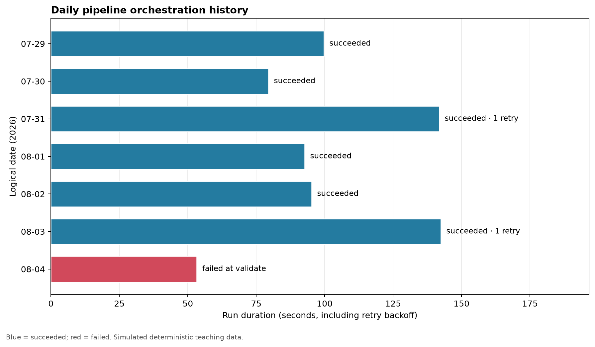

# Orchestration and Scheduling {#sec-orchestration-and-scheduling}

::: cdi-message
- **ID:** DSDP-013
- **Type:** Core guide chapter
- **Audience:** Data practitioners moving from runnable pipelines to dependable scheduled workflows
- **Theme:** Coordinate pipeline work explicitly, observe every run, and recover safely
:::

A data pipeline is not operational merely because its tasks run successfully from a terminal. Production work must start at the right time, respect dependencies, avoid unsafe overlap, record what happened, retry only when appropriate, and alert someone when automated recovery is exhausted. **Orchestration** provides that control layer. **Scheduling** is one trigger within it.

This chapter develops a local, tool-neutral orchestration model for the running case study. A small Python program simulates scheduled pipeline runs, dependency checks, retries, concurrency protection, and operational metrics. The same reasoning transfers to Airflow, Dagster, Prefect, managed cloud orchestrators, and other workflow systems.

## Learning objectives

By the end of this chapter, you should be able to:

- distinguish a scheduler from an orchestrator;
- model a pipeline as tasks and explicit dependencies;
- choose between time-, event-, and data-aware triggers;
- define retry, timeout, concurrency, and late-data policies;
- explain how idempotency makes reruns and backfills safer;
- interpret run-level operational metrics; and
- specify a production-ready orchestration contract.

## From scripts to managed runs

Suppose the pipeline introduced earlier contains four stages:

1. extract source records;
2. validate the landing data;
3. transform accepted records;
4. publish a partition for downstream use.

A shell script can execute those stages in order. It usually does not answer the operational questions that appear immediately afterward:

- What if extraction starts late?
- What if validation fails twice and then succeeds?
- Can two runs publish the same partition concurrently?
- Which date should a rerun process?
- How does an operator know which task failed?
- Can the failed run resume without repeating successful work?

An orchestrator turns each pipeline execution into a **run** with identity, state, timestamps, parameters, logs, and task-level outcomes.

## Scheduling is only the trigger

A scheduler decides *when a run becomes eligible to start*. An orchestrator manages *what happens after that trigger*.

| Concern | Scheduler | Orchestrator |
|---|---|---|
| Time or event trigger | Primary responsibility | Accepts and records trigger |
| Dependency ordering | Usually limited | Core responsibility |
| Retries and timeouts | Sometimes | Task-aware policies |
| Run history | Basic | Detailed run and task state |
| Concurrency control | Often coarse | Workflow-, task-, or resource-level |
| Backfills | May emit times | Maps intervals to reproducible runs |
| Alerts | Trigger failure | Context-rich operational alerts |

A cron entry can start a script every morning. It cannot, by itself, guarantee that the input partition exists, prevent overlapping publications, preserve the logical data interval, or resume from the failed task.

## Model the workflow as a directed graph

An orchestrated pipeline is commonly represented as a directed acyclic graph (DAG). Tasks are nodes; dependency relationships are directed edges. The graph must be acyclic so that every run has a valid execution order.

For the case-study workflow:

```text
extract -> validate -> transform -> publish
```

The important idea is not the diagram itself. It is the contract behind every node.

| Task | Reads | Writes | Success condition | Safe to retry? |
|---|---|---|---|---|
| `extract` | source interval | immutable landing object | expected object and metadata exist | Yes, with deterministic key |
| `validate` | landing object | quality report | blocking checks pass | Yes |
| `transform` | accepted landing data | staged partition | schema and row rules hold | Yes, with replace semantics |
| `publish` | staged partition | curated partition | atomic promotion succeeds | Yes, if promotion is idempotent |

Explicit contracts prevent orchestration code from becoming a collection of vague commands. Each task should have a narrow responsibility and a verifiable output.

## Separate wall-clock time from data time

One of the most important orchestration concepts is the distinction between:

- **trigger time**: when the orchestrator starts or queues the run;
- **logical date**: the data interval represented by the run;
- **actual start time**: when execution capacity becomes available; and
- **completion time**: when the terminal state is recorded.

A run triggered at `2026-08-06 02:00` may process the complete UTC interval for `2026-08-05`. Using the current clock inside pipeline logic would make a later rerun process different data. Instead, the orchestrator should pass an explicit interval such as:

```text
interval_start = 2026-08-05T00:00:00Z
interval_end   = 2026-08-06T00:00:00Z
```

Every task then derives input and output locations from that interval. This makes retries, historical reruns, and backfills reproducible.

## Choose the right trigger

### Time-based scheduling

Time-based schedules are appropriate when data is expected at predictable intervals and downstream users need a stable publication rhythm. A daily run might be eligible at 02:00 after the source system closes its business day.

Time alone does not prove readiness. Add a bounded readiness check or a data-availability condition when upstream delivery can vary.

### Event-based triggering

An event can announce that a source file arrived, an upstream table partition was committed, or an API export completed. Event-driven runs reduce unnecessary polling and may lower latency.

Events must be treated as delivery signals, not unquestioned truth. They can be duplicated, delayed, or reordered. Store a stable event identifier and make run creation idempotent.

### Data-aware triggering

A data-aware trigger starts work only when declared upstream datasets or partitions are ready. This expresses the real dependency more accurately than guessing a clock time. It is especially useful when several upstream workflows contribute to one downstream product.

### Manual triggering

Manual runs remain valuable for controlled recovery, testing, and exceptional reprocessing. A manual trigger should require the same explicit interval and parameters as an automated run; it should not bypass contracts.

## Define task and run states

A clear state model allows operators and automation to reason consistently. A compact model includes:

- `scheduled`: the run is registered for an interval;
- `queued`: dependencies are satisfied, but execution capacity is pending;
- `running`: a worker is executing the task or run;
- `retrying`: a retryable failure occurred and another attempt is planned;
- `succeeded`: all required success conditions hold;
- `failed`: automated recovery is exhausted or the error is non-retryable;
- `skipped`: a branch or upstream condition intentionally prevented execution; and
- `cancelled`: an operator or policy stopped the run.

Do not equate process exit code zero with pipeline success. A task should verify the output contract before entering `succeeded`.

## Retry deliberately

Retries are useful for transient conditions such as temporary network failure, rate limiting, or brief service unavailability. They are harmful when applied blindly to invalid credentials, incompatible schemas, corrupt inputs, or deterministic code defects.

A retry policy should specify:

- the retryable exception or status classes;
- the maximum attempts;
- initial delay and backoff multiplier;
- random jitter to avoid synchronized retry storms;
- a maximum delay; and
- the terminal action after exhaustion.

For example, three attempts with exponential backoff might wait 30 seconds and then 60 seconds between attempts. The run history must retain all attempts. Operators need to know that a task succeeded after retries because repeated transient failures may indicate a deteriorating dependency.

## Use timeouts and service-level expectations

A stalled task can be more damaging than a failed task because it occupies capacity and delays downstream work without reaching a terminal state. Define timeouts from observed behavior, not arbitrary round numbers.

Useful timing measures include:

- **queue delay**: actual start minus scheduled time;
- **task duration**: task completion minus task start;
- **run duration**: terminal time minus run start;
- **schedule delay**: run start minus expected trigger time; and
- **freshness lag**: publication time minus the end of the data interval.

If the daily product must be available by 06:00, that is an operational objective. A run can technically succeed at 10:00 and still violate the product expectation.

## Prevent unsafe overlap

Concurrency improves throughput only when tasks do not contend for the same mutable resource. Common controls include:

- one active run per workflow;
- one active run per logical partition;
- worker pools for rate-limited APIs or databases;
- task-level concurrency limits; and
- atomic publication or compare-and-swap behavior.

For a daily partition pipeline, a strong default is to prevent two runs for the same interval from publishing simultaneously. Different independent partitions may still run in parallel if source and warehouse capacity permit.

## Make retries and backfills idempotent

An idempotent task can run more than once for the same inputs and produce the same intended state. Practical techniques include:

- derive object and table partition names from the logical interval;
- write to a temporary location and promote atomically;
- use merge, upsert, or partition replacement with stable business keys;
- record source checkpoints and content hashes;
- avoid unguarded append operations; and
- separate computation from publication.

Idempotency is not an optional optimization. It is what allows retries, reruns, and backfills to be routine rather than dangerous.

## Backfills are controlled historical runs

A backfill creates runs for past intervals. It may be needed after fixing logic, receiving late data, or introducing a new derived field.

Before starting a backfill, define:

1. the exact interval range;
2. the code and configuration version;
3. source-data availability and retention;
4. expected write semantics;
5. concurrency and rate limits;
6. downstream notification or refresh behavior; and
7. validation and rollback criteria.

Do not let a large backfill starve current scheduled runs. Use a separate worker pool, lower priority, or a bounded number of active historical intervals.

## Observe the control plane

Pipeline data metrics and orchestration metrics answer different questions. Both are required.

| Layer | Example metrics |
|---|---|
| Orchestration | run success rate, retry rate, queue delay, duration, missed schedules |
| Data quality | row count, null rate, uniqueness, schema compatibility |
| Data product | freshness, partition completeness, downstream availability |
| Infrastructure | worker saturation, memory, network errors, API throttling |

Alerts should be actionable. A useful failure alert identifies the workflow, logical interval, failed task, attempt count, error class, run link or log location, and expected next action. Avoid paging on a first transient failure when the retry policy is working as designed.

## Case study: simulate scheduled runs

The chapter script, `scripts/python/13-simulate-orchestration.py`, creates a deterministic seven-run history for the daily workflow. It demonstrates:

- a fixed logical interval for each run;
- sequential dependency enforcement;
- bounded retries for transient failures;
- a non-retryable validation failure;
- an idempotency key per interval and task;
- run and task event records; and
- operational summaries and a diagnostic plot.

Run it from the repository root:

```bash
bash scripts/bash/13-run-orchestration-simulation.sh
```

The command creates:

- `results/13-orchestration-runs.csv`;
- `results/13-orchestration-events.csv`;
- `results/13-orchestration-summary.json`; and
- `results/figures/13-orchestration-run-history.png`.

{#fig-orchestration-run-history fig-alt="Horizontal bars show simulated pipeline duration by logical date. Successful runs are blue, the failed validation run is red, and retry counts are annotated."}

The simulation is intentionally local: it teaches orchestration semantics without requiring a server or vendor-specific project. The generated event table can be inspected like an orchestrator's metadata history.

## Read the run history

The summary separates final reliability from recovery activity. A run that succeeds after a retry contributes to the final success rate, while the retry rate reveals dependency instability that the success rate alone would hide.

Ask these questions when interpreting the outputs:

- Did every logical interval produce exactly one terminal run?
- Which task accounts for retries?
- Is the failed task retryable or deterministic?
- Did successful recovery still breach the freshness objective?
- Are durations drifting upward across intervals?
- Would the publication operation remain correct if repeated?

This is the operational habit orchestration should create: reason from explicit state and evidence, not from whether a scheduled command appears to have run.

## A production orchestration contract

Before deploying a workflow, record the following fields in code or version-controlled configuration.

| Contract field | Example |
|---|---|
| Workflow ID | `daily_orders_pipeline` |
| Trigger | daily at 02:00 UTC after readiness check |
| Logical interval | previous UTC calendar day |
| Catch-up policy | enabled for explicitly approved intervals |
| Maximum active runs | 1 current, 2 backfill |
| Task retries | extract: 2; validate: 0; transform: 1; publish: 1 |
| Timeouts | per task plus four-hour run deadline |
| Idempotency scope | workflow + interval + task |
| Success condition | curated partition and quality manifest committed |
| Alert owner | data platform on-call |
| Recovery action | retry transient failure; quarantine invalid data; rerun interval after correction |

## Common failure patterns

### Using the current date inside tasks

The same rerun selects different inputs. Pass a logical interval explicitly and derive all paths from it.

### Retrying every exception

Deterministic failures consume resources and delay diagnosis. Classify failures and retry only transient conditions.

### Allowing overlapping writes

Two runs modify the same partition and produce nondeterministic output. Apply interval-level concurrency control and atomic publication.

### Hiding work inside one large task

The orchestrator cannot isolate failures or resume efficiently. Split work at meaningful, independently verifiable boundaries—not at every function call.

### Treating a backfill as a loop in production

A local loop lacks per-interval state, capacity controls, and clear recovery. Materialize backfill intervals as ordinary observable runs.

### Alerting without context

An alert that says only “pipeline failed” transfers investigation work to the operator. Include the identity, interval, failed task, attempts, and recovery expectation.

## Design checklist

Before calling a pipeline orchestrated, confirm that:

- tasks and dependencies are explicit;
- every run has a stable workflow ID and logical interval;
- outputs are deterministic for that interval;
- retryable and non-retryable failures are distinguished;
- retries have bounded backoff and retained attempt history;
- task and run timeouts are defined;
- unsafe overlapping runs are prevented;
- backfills use the same contracts as current runs;
- success checks validate outputs, not only exit codes;
- logs and metrics connect to run and task identity; and
- alerts identify an owner and a recovery action.

## Key takeaways

- Scheduling decides when work becomes eligible; orchestration manages dependencies, state, recovery, and evidence.
- Logical data intervals make reruns and backfills reproducible.
- Retries are appropriate only for classified transient failures.
- Idempotent tasks and atomic publication make automated recovery safe.
- Concurrency must be constrained at the resource or partition that can be corrupted.
- Final success rate, retry activity, duration, queue delay, and freshness must be observed together.
- A workflow is production-ready when its execution and recovery policies are explicit, testable, and owned.

The next chapter extends this operational foundation into testing, monitoring, and observability across the pipeline and its data products.
