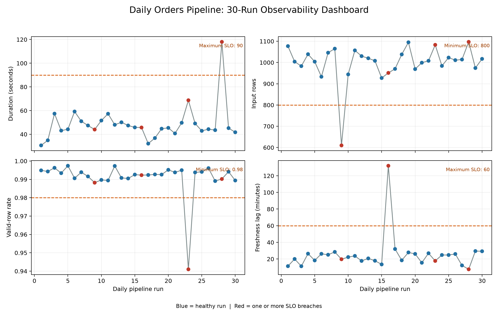

# Testing, Monitoring, and Observability {#sec-testing-monitoring-observability}

::: cdi-message
- **ID:** DSDP-014
- **Type:** Guide chapter
- **Audience:** Data practitioners building reliable batch pipelines
- **Theme:** Detect failures early and diagnose them quickly
:::

Data pipelines rarely fail only by crashing. A run can finish successfully and still publish stale, incomplete, duplicated, or implausible data. Reliable pipelines therefore need three related capabilities:

- **Testing** checks expected behaviour before and during execution.
- **Monitoring** measures known operational and data-health signals over time.
- **Observability** preserves enough evidence to explain an unexpected state.

This chapter builds those capabilities around a small orders pipeline. The example produces structured run metadata, evaluates service-level objectives (SLOs), and creates a monitoring dashboard from multiple simulated runs.

## Learning objectives

By the end of this chapter, you will be able to:

1. test functions, stage boundaries, data contracts, and complete runs;
2. monitor freshness, volume, quality, duration, and failures;
3. define actionable SLOs and alert conditions;
4. emit structured run metadata that supports fast diagnosis; and
5. distinguish symptoms, causes, and debugging evidence.

## A layered testing strategy

No single test answers every reliability question. A useful test suite moves from fast, isolated checks to broader workflow validation.

| Layer | Main question | Example | Typical frequency |
|---|---|---|---|
| Unit | Does one function behave correctly? | Revenue equals `quantity * unit_price` | Every change |
| Contract | Does data match the expected interface? | Required columns and types exist | Every run and change |
| Integration | Do adjacent stages work together? | Extracted rows load into the target schema | Every change |
| Data quality | Is this run's data fit for use? | IDs are unique and prices are non-negative | Every run |
| End-to-end | Does the complete workflow produce the expected output? | Raw orders become a valid summary | Before release; scheduled smoke test |

The **test pyramid** still applies: keep many deterministic unit and contract tests, fewer integration tests, and a small number of end-to-end tests. Broad tests are valuable, but they are slower and usually identify a larger area rather than the exact faulty function.

### Test behaviour, not implementation details

A durable test describes an invariant. For example:

```python
def test_revenue_is_quantity_times_price():
    row = {"quantity": 3, "unit_price": 12.50}
    assert calculate_revenue(row) == 37.50
```

This test remains useful if the internal implementation changes. A test that mocks every internal call may pass while the real stage boundary is broken.

### Test the unhappy paths

Production incidents usually live outside the ideal sample. Include cases such as:

- empty extracts;
- missing or extra columns;
- null business keys;
- duplicate records;
- invalid timestamps and late-arriving data;
- negative quantities or prices;
- partial writes and retries; and
- upstream timeouts or malformed responses.

The included test file covers transformation behaviour, contract violations, duplicate detection, and an end-to-end run. Run it from the repository root:

```bash
python -m pytest -q tests/test_14_observable_pipeline.py
```

## Data contracts at stage boundaries

A data contract makes assumptions explicit. At minimum, it should describe:

- required fields;
- accepted data types and formats;
- nullability;
- uniqueness or key constraints;
- allowed ranges or categories; and
- ownership and change expectations.

In the example pipeline, an order must have `order_id`, `customer_id`, `order_ts`, `quantity`, and `unit_price`. Contract validation happens before transformation so that a malformed input cannot quietly contaminate downstream tables.

```python
REQUIRED_COLUMNS = {
    "order_id",
    "customer_id",
    "order_ts",
    "quantity",
    "unit_price",
}
```

Schema validation and semantic validation solve different problems. A value such as `-20.00` can be a valid number while still being an invalid unit price. Both checks are needed.

## What to monitor

Monitoring begins with the consumer's expectations, not with every metric the system can emit. Five signal groups cover most batch pipelines.

### Freshness

Freshness measures how far the newest usable event is behind the observation time:

$$
\text{freshness lag} = t_{\text{observed}} - \max(t_{\text{event}})
$$

A successful run that republishes yesterday's extract is operationally successful but not fresh.

### Volume

Track input rows, output rows, rejected rows, and changes from a recent baseline. Volume alerts should allow normal business variation. A zero-row result may be valid for one dataset and a critical failure for another.

### Quality

Useful quality measures include:

- completeness: proportion of required values present;
- uniqueness: proportion of keys without duplication;
- validity: proportion satisfying domain rules; and
- consistency: agreement across related fields or tables.

For a check with $n_{\text{failed}}$ failures among $n_{\text{total}}$ records:

$$
\text{pass rate} = 1 - \frac{n_{\text{failed}}}{n_{\text{total}}}
$$

Always store the failed count alongside the rate. A 99.9% pass rate has different consequences for one thousand and one billion records.

### Duration and throughput

Record total duration and stage durations. A rising extract duration can reveal upstream throttling; a rising load duration can reveal target contention. A total duration alone cannot distinguish them.

### Failures and retries

Track terminal status, failure stage, error category, attempt number, and retry count. Repeated successful retries are still a reliability signal: they consume time and often precede a terminal failure.

## From metrics to service-level objectives

An SLO states the acceptable level of service for a defined measurement window. For this demonstration, a healthy run must meet all of these conditions:

| Signal | Demonstration SLO | Alert meaning |
|---|---:|---|
| Status | `success` | A pipeline stage failed |
| Freshness lag | at most 60 minutes | Published data is too old |
| Input volume | at least 800 rows | Extraction may be incomplete |
| Valid-row rate | at least 98% | Excessive invalid records |
| Duration | at most 90 seconds | The delivery window is at risk |

Thresholds in a real project should come from consumer needs and historical behaviour. Alerts also need a clear owner, severity, notification route, and response playbook. If nobody knows what to do when an alert fires, it is only noise.

## Structured run metadata

Logs explain individual events; run metadata summarizes one workflow execution. A compact run record should include:

```json
{
  "pipeline_name": "daily-orders",
  "run_id": "daily-orders-20260806T030000Z",
  "started_at": "2026-08-06T03:00:00+00:00",
  "status": "success",
  "input_rows": 1024,
  "output_rows": 1011,
  "freshness_lag_minutes": 18.0,
  "valid_row_rate": 0.9873,
  "duration_seconds": 43.2,
  "failed_checks": []
}
```

Use UTC timestamps and carry the same `run_id` through logs, metrics, lineage records, and alerts. This correlation key turns several disconnected signals into one diagnosable execution.

Avoid logging secrets, tokens, or complete sensitive records. Log stable identifiers, counts, stage names, error categories, and safe samples where policy permits.

## Practical: generate and inspect monitoring evidence

The script `scripts/python/14-monitor-observable-pipeline.py` creates 30 deterministic pipeline runs. It introduces four controlled incidents: low volume, stale data, poor quality, and excessive duration. Each run is evaluated against the SLOs.

Run:

```bash
python scripts/python/14-monitor-observable-pipeline.py
```

The script writes:

- `results/14-pipeline-run-metadata.csv` — one row per run;
- `results/14-monitoring-summary.json` — aggregate health and alert counts; and
- `results/figures/14-pipeline-observability-dashboard.png` — an operational view of the monitored signals.

{#fig-pipeline-observability-dashboard fig-alt="A four-panel pipeline monitoring dashboard. Most runs are healthy; four highlighted runs breach duration, volume, quality, or freshness thresholds."}

The dashboard in @fig-pipeline-observability-dashboard deliberately separates the signals. A single green “pipeline succeeded” indicator would conceal three of the four data incidents.

## Diagnose with symptoms, causes, and evidence

Monitoring tells you that a known condition changed. Observability helps you investigate why.

| Symptom | Possible causes | Evidence to inspect |
|---|---|---|
| Low input volume | Partial extract, upstream delay, real business change | Source count, extraction window, API pages, historical baseline |
| High freshness lag | Late source, stale cache, wrong watermark | Maximum event time, watermark, source update time |
| Falling valid-row rate | Source schema drift, parsing bug, new category | Failed-rule counts, quarantined samples, deployed version |
| Rising duration | Throttling, data growth, lock contention | Stage timings, retries, query plan, resource metrics |
| Output exceeds input | Join fan-out, replay, duplicate load | Key cardinality, join diagnostics, idempotency key |

A productive incident workflow is:

1. identify the breached SLO and affected runs;
2. locate the first abnormal stage or metric;
3. correlate evidence by `run_id`, dataset, and code version;
4. contain the impact, for example by stopping publication or using the last known good table;
5. correct and safely rerun the affected interval; and
6. add a regression test or monitor that detects the failure earlier.

## Alert design and common failure modes

Prefer alerts that are actionable and close to user impact. Page immediately for a failed critical delivery; route a small baseline deviation to a lower-priority review queue.

Common mistakes include:

- **Monitoring only infrastructure.** Healthy CPU and memory do not imply healthy data.
- **Alerting on every fluctuation.** Static thresholds without business context create alert fatigue.
- **Recording only failures.** Healthy-run history is required to establish baselines.
- **Using averages alone.** Averages can hide tail latency and concentrated data-quality failures.
- **Discarding rejected records.** Quarantine them with reason codes and retention controls.
- **Treating retries as harmless.** Retry trends can expose degrading dependencies.
- **Keeping dashboards without ownership.** Every critical SLO needs an accountable owner and response path.

## Production hardening

The chapter example stores metadata in local files so the workflow is transparent. In production, preserve the same concepts while changing the destination:

- send structured logs to a searchable log platform;
- export metrics to a time-series monitoring system;
- store run history in an orchestration metadata database;
- retain lineage between input, transformation, and published dataset;
- version contracts and validate compatibility during deployment;
- maintain runbooks for critical alerts; and
- test alert delivery periodically, not only the alert rule.

## Chapter checklist

Before calling a pipeline observable, confirm that:

- [ ] pure transformation functions have deterministic unit tests;
- [ ] schemas and semantic rules are validated at boundaries;
- [ ] a small end-to-end test exercises the real stage sequence;
- [ ] freshness, volume, quality, duration, status, and retries are recorded;
- [ ] each run has a unique correlation identifier and UTC timestamps;
- [ ] SLOs reflect consumer expectations;
- [ ] alerts identify an owner and a response action;
- [ ] rejected data is quarantined safely;
- [ ] dashboards show trends and thresholds, not only current values; and
- [ ] incidents produce regression tests or improved monitors.

## Key takeaways

Testing prevents known defects from reaching production. Monitoring detects known unhealthy conditions during operation. Observability supplies the contextual evidence needed to explain conditions that were not predicted in advance. A reliable pipeline uses all three: layered tests, consumer-centred SLOs, and correlated run evidence that makes recovery faster and safer.

