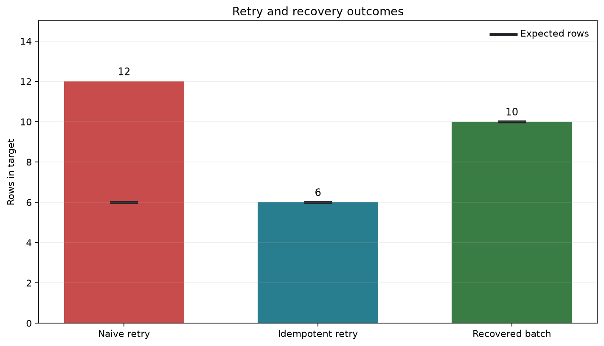

# Recovery, Idempotency, and Backfills {#sec-recovery-idempotency-backfills}

::: {.cdi-message}
- **ID:** DSDP-015
- **Type:** Core chapter
- **Audience:** Data practitioners building production pipelines
- **Theme:** Recoverable and repeatable data operations
:::

Pipelines fail. Networks time out, source systems become unavailable, workers stop, and malformed records reach transformations. Reliability does not mean preventing every failure. It means making failure bounded, visible, and safe to recover from.

This chapter extends the operational practices from @sec-testing-monitoring-observability. It uses a small SQLite order pipeline to make recovery concrete: a batch is recorded in a run ledger, rows are loaded with deterministic keys, commits occur at explicit boundaries, and bounded backfills use the same production-safe write path as scheduled runs.

## Learning objectives

After completing this chapter, you will be able to:

- design repeatable runs that do not duplicate outputs;
- resume safely after partial failure;
- distinguish retries, replays, recovery, and backfills;
- select transaction and checkpoint boundaries deliberately;
- plan bounded backfills without disrupting current production data; and
- verify that recovery preserved completeness and uniqueness.

## 15.1 The recovery problem

Consider a daily pipeline with four stages:

1. extract source orders;
2. validate and transform them;
3. load a curated table; and
4. publish completion metadata.

If the worker stops after loading records but before publishing completion, the orchestrator sees a failed run even though some outputs exist. Blindly rerunning the batch can duplicate rows. Deleting everything first can erase valid concurrent data. Skipping the run can leave an incomplete partition.

A recoverable pipeline records enough state to answer three questions:

- **What was intended?** The batch identity and bounded source interval.
- **What completed?** Durable checkpoints, run status, and row counts.
- **What may be repeated safely?** Operations protected by idempotent keys, transactions, or atomic replacement.

### Recovery vocabulary

| Operation | Purpose | Typical trigger | Data interval |
|---|---|---|---|
| Retry | Repeat a failed attempt | Transient error | Same run and interval |
| Replay | Process the same input again | Validation or logic check | Same historical input |
| Resume | Continue after a checkpoint | Partial failure | Unfinished portion |
| Backfill | Recompute missing or corrected history | Late data or new logic | Explicit historical range |
| Rebuild | Recreate a derived asset | Corruption or major logic change | Entire asset or large scope |

These terms describe intent, not implementation. All five still require controlled writes and verification.

## 15.2 Idempotency as a pipeline contract

An operation is **idempotent** when applying it more than once has the same intended effect as applying it once. For a pipeline batch $B$ and target state $T$, the desired property is:

$$
f_B(f_B(T)) = f_B(T).
$$

This does not mean the second run performs no work. It means repeated execution does not create an additional business effect.

### Stable identity

Idempotency begins with stable identifiers:

- a business key, such as `order_id`;
- a source event identifier;
- a deterministic composite key, such as `(customer_id, event_time, event_type)`; or
- a content hash when the source supplies no reliable identifier.

An auto-incrementing target key alone cannot prevent duplicates because every repeated insert receives a new value.

### Idempotent write patterns

**Upsert by business key.** Insert unseen rows and update matching rows. In SQLite, `ON CONFLICT ... DO UPDATE` makes the conflict behavior explicit.

```sql
INSERT INTO curated_orders (order_id, order_date, customer_id, amount, source_updated_at)
VALUES (?, ?, ?, ?, ?)
ON CONFLICT(order_id) DO UPDATE SET
    order_date = excluded.order_date,
    customer_id = excluded.customer_id,
    amount = excluded.amount,
    source_updated_at = excluded.source_updated_at
WHERE excluded.source_updated_at >= curated_orders.source_updated_at;
```

The timestamp condition prevents older replays from overwriting newer target values.

**Replace a bounded partition.** Build the replacement away from the live table, validate it, then swap or replace only the requested partition. This works well when a partition is the unit of correctness.

**Append with deduplication.** Preserve immutable events, enforce a unique event key, and treat duplicates as no-ops. This is appropriate for event histories but not for mutable snapshots.

**Compare-and-set.** Update a row only when its current version matches the version previously read. This protects concurrent state changes.

### Idempotency keys and run identifiers

A `run_id` identifies an execution attempt. An `idempotency_key` identifies the logical effect. Retrying a logical batch should normally create a new attempt identifier while retaining the same idempotency key. For example:

```text
run_id:            scheduled__2026-08-06T01:00:00Z__attempt_2
idempotency_key:   orders__2026-08-05
```

Conflating the two makes it difficult to distinguish a legitimate retry from an unrelated duplicate request.

## 15.3 Transactions and commit boundaries

A database transaction groups statements into an atomic unit: either all committed changes become visible or none do. Transactions are the first defence against partial writes.

```python
with connection:
    load_rows(connection, batch)
    record_batch_complete(connection, batch_id)
```

If either statement raises an exception, the context manager rolls back both operations. A run ledger must not say `succeeded` while the corresponding data remains incomplete.

### Choosing the boundary

One transaction for an entire batch gives simple all-or-nothing behavior but may hold locks, generate a large log, and make long jobs expensive to retry. Smaller transactions reduce lock duration but introduce partial completion. When chunking is necessary:

1. choose a stable chunk order;
2. commit data and its checkpoint in the same transaction;
3. make every chunk idempotent; and
4. verify the complete batch before publishing it.

The checkpoint describes the **last durably committed unit**, never the last row merely read or transformed in memory.

## 15.4 Checkpointing and safe resume

A useful checkpoint contains enough information to reproduce the next read:

| Field | Example | Purpose |
|---|---|---|
| `pipeline_name` | `daily_orders` | Names the workflow |
| `batch_key` | `orders__2026-08-05` | Identifies the logical batch |
| `last_committed_key` | `O-00420` | Defines the resume position |
| `source_high_watermark` | `2026-08-06T00:00:00Z` | Freezes the source boundary |
| `status` | `running` | Describes lifecycle state |
| `updated_at` | timestamp | Supports stale-run detection |

Freezing a high watermark is essential. Without it, a resumed extraction may include records that arrived after the original run began, changing the batch while it is being recovered.

### Checkpoint trade-offs

- **Per batch:** least metadata, most repeated work.
- **Per chunk:** balanced for most batch pipelines.
- **Per record:** precise but expensive and usually unnecessary.

Checkpoint frequency should reflect the cost of repeating work and the complexity of managing partial state.

## 15.5 Failure classification and retry policy

Retries help only when the failure may disappear without changing the input or code.

| Failure | Retry? | Response |
|---|---:|---|
| Network timeout | Yes | Exponential backoff with jitter |
| Rate limit | Yes | Respect server delay or quota window |
| Temporary database lock | Yes | Bounded retry |
| Invalid record | No | Quarantine or reject with context |
| Schema incompatibility | No | Stop, investigate, and update contract |
| Permission denied | Usually no | Correct identity or policy |
| Deterministic code defect | No | Fix, test, and replay |

Every retry policy needs a maximum attempt count, maximum elapsed time, retryable exception list, and terminal failure action. Unlimited retries convert a visible failure into an invisible stalled pipeline.

## 15.6 A runnable recovery demonstration

The companion program `scripts/python/15-demonstrate-recovery.py` creates a temporary SQLite database and evaluates three cases:

1. a naive append load followed by a retry;
2. an idempotent upsert followed by the same retry; and
3. a simulated failure after one committed chunk, followed by checkpoint-based recovery.

Run it from the repository root:

```bash
bash scripts/bash/15-run-recovery-demo.sh
```

The wrapper writes the database and evidence under `results/`, then produces @fig-recovery-comparison.

{#fig-recovery-comparison}

The result summary is machine-readable:

```json
{
  "naive_rows_after_retry": 12,
  "idempotent_rows_after_retry": 6,
  "recovered_rows": 10,
  "expected_recovered_rows": 10,
  "duplicate_business_keys_after_recovery": 0,
  "checkpoint_after_recovery": 10
}
```

The demonstration deliberately commits the first chunk before raising an exception. Recovery reads the durable checkpoint, resumes at the next source position, and uses the same upsert operation for all later chunks. Repeating the recovery step remains safe.

## 15.7 Designing bounded backfills

A backfill is a production change, even when it targets old data. Define it with an explicit half-open interval:

$$
[t_{start}, t_{end})
$$

Half-open intervals compose without overlap: daily windows `[Aug 1, Aug 2)` and `[Aug 2, Aug 3)` cover adjacent days exactly once.

### Backfill plan

Before execution, record:

- the reason and owner;
- start and exclusive end boundaries;
- affected datasets and downstream consumers;
- code, schema, and reference-data versions;
- expected partitions and approximate row volume;
- concurrency and rate limits;
- validation queries;
- pause, rollback, or repair conditions; and
- how completion will be communicated.

### Protect current production work

Use the same tested transformation and write path as the scheduled pipeline, but isolate the backfill operationally:

- assign a distinct run type and backfill identifier;
- cap parallelism so current runs retain capacity;
- process small windows in deterministic order;
- avoid overlapping live and backfill ownership of a partition;
- validate each window before advancing; and
- make the backfill restartable from its last successful window.

A separate, untested “backfill script” easily drifts from production logic. Parameterize the production job with a bounded interval instead.

### Late-arriving and corrected records

Event time describes when a business event occurred; processing time describes when the pipeline observed it. Late data makes these differ. A robust pipeline can combine:

- a moving reprocessing window for recent partitions;
- source update timestamps or change-data-capture positions;
- deterministic upserts; and
- a policy for reopening previously complete partitions.

Completion should therefore mean “complete under the declared lateness policy,” not “incapable of ever changing.”

## 15.8 Verification after recovery or backfill

Successful execution is not proof of correct recovery. Verify at several levels.

### Structural checks

- expected partitions exist;
- primary or business keys are unique;
- required fields satisfy null constraints;
- schemas match the data contract; and
- no temporary tables or locks remain.

### Reconciliation checks

For each bounded interval, compare source and target:

$$
\Delta_{count} = N_{source} - N_{target}
$$

Counts alone can agree while rows differ. Add sums for additive measures, minimum and maximum timestamps, distinct key counts, and deterministic hashes where appropriate.

### Operational checks

- the run ledger has one terminal status;
- checkpoints align with committed data;
- retry and error counts are plausible;
- current scheduled runs remained healthy; and
- downstream refreshes were triggered exactly once.

The demo writes `results/15-recovery-verification.csv`, which records the expected and observed value for every acceptance check. This is evidence, not merely console output.

## 15.9 Anti-patterns

### Retry every exception

Malformed data and broken contracts do not improve with repetition. Classify failures and retry only transient conditions.

### Delete before reload

An unconditional delete creates a period with missing data and can remove changes owned by another run. Stage and validate replacement data or perform deletion and insertion in one controlled transaction.

### Advance checkpoints before commit

If the process stops between checkpoint advancement and data commit, recovery skips data permanently. Commit the output and checkpoint atomically.

### Use processing time as the only cursor

Rows can share timestamps, clocks can differ, and late records can fall behind the cursor. Use a stable tie-breaker such as `(updated_at, source_id)` and overlap windows when the source cannot guarantee ordering.

### Backfill everything at full concurrency

Historical work can saturate databases, APIs, and queues needed by current production runs. Bound both time range and resource consumption.

## 15.10 Recovery runbook

When a production pipeline fails:

1. **Contain:** pause unsafe downstream publication and prevent overlapping ownership.
2. **Classify:** determine whether the failure is transient, data-related, code-related, or infrastructure-related.
3. **Inspect durable state:** read the run ledger, target data, high watermark, and last committed checkpoint.
4. **Select an action:** retry, resume, replay, bounded backfill, or rebuild.
5. **Estimate impact:** identify missing, duplicated, stale, and downstream data.
6. **Execute safely:** reuse idempotent writes and explicit intervals with controlled concurrency.
7. **Verify:** reconcile source and target, check uniqueness, and confirm checkpoints.
8. **Publish:** release outputs only after acceptance checks pass.
9. **Document:** retain evidence, incident notes, and preventive actions.

## 15.11 Practical exercises

1. Run the demonstration twice. Confirm that the recovery table still contains ten unique business keys.
2. Modify one source amount and rerun the idempotent load with a newer `source_updated_at`. Confirm that the target changes without adding a row.
3. Reverse the timestamp comparison in the upsert. Explain how an old replay can now corrupt newer data.
4. Change the recovery chunk size from three to four. Simulate failure after the second commit and identify the correct resume position.
5. Draft a backfill plan for seven missing daily partitions while the normal daily schedule continues.

## 15.12 Chapter summary

Reliable recovery is designed before failure occurs. Stable business keys and deterministic writes make repeated execution safe. Transactions align data with run metadata, while checkpoints reduce repeated work without pretending partial progress is complete. Backfills must be explicitly bounded, resource-aware, restartable, and verified like any other production change.

The essential principle is simple: **repeat the computation when necessary, but never repeat an unintended business effect.**

