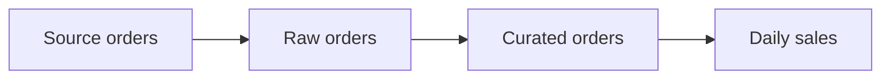
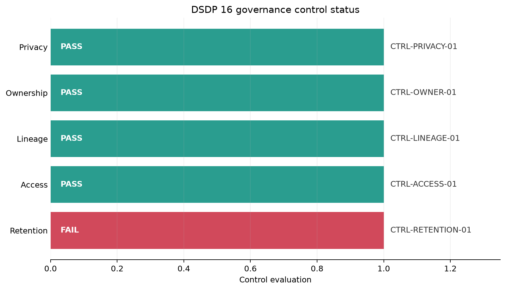

# Security, Governance, and Lineage {#sec-security-governance-lineage}

::: cdi-message
- **ID:** DSDP-016
- **Type:** Guide chapter
- **Audience:** Data practitioners building production data pipelines
- **Theme:** Secure, governed, and traceable data delivery
:::

Security, governance, and lineage are not separate layers added after a pipeline works. They define whether the pipeline is allowed to run, which data it may process, how its actions can be reviewed, and whether a published value can be traced back to its origin.

This chapter develops a compact control model for a customer-order pipeline. The example is intentionally local and reproducible, but the same reasoning applies to cloud object stores, warehouses, orchestrators, and streaming systems.

## Learning objectives

By the end of this chapter, you will be able to:

- protect credentials and sensitive data across pipeline stages;
- apply least privilege, retention, and audit controls;
- distinguish authentication, authorization, encryption, masking, and deletion;
- record dataset- and column-level lineage from source fields to published outputs;
- turn governance requirements into testable pipeline controls; and
- generate an evidence bundle that supports operational review.

## Why these concerns belong together

A reliable pipeline answers more than *did the job succeed?*

| Concern | Question | Typical evidence |
|---|---|---|
| Security | Who or what may access the data? | roles, policies, secret references, access logs |
| Privacy | How is sensitive data minimized and protected? | classification, masking rules, retention rules |
| Governance | Who owns the data and which rules apply? | catalog metadata, control results, approvals |
| Lineage | Where did this output come from? | source-to-target mappings, run identifiers |
| Auditability | Can an independent reviewer reconstruct events? | immutable events, timestamps, actor and outcome |

These concerns reinforce one another. Classification determines access and retention rules. Lineage identifies every downstream asset affected by a sensitive source. Audit events show whether controls ran and whether exceptions were approved.

## Start with data classification

Controls should be proportional to the data. A practical classification scheme is small enough to be used consistently.

| Class | Example | Default handling |
|---|---|---|
| Public | published aggregate statistics | broad read access; integrity controls |
| Internal | pipeline run metrics | authenticated organizational access |
| Confidential | customer identifiers and order details | restricted roles, encryption, auditing |
| Restricted | passwords, access tokens, regulated identifiers | avoid collection where possible; strongest controls |

Classification should be attached to fields, not only datasets. A table can contain public aggregates alongside confidential identifiers. Field-level labels make masking, projection, and lineage checks more precise.

```yaml
dataset: raw.customer_orders
owner: data-platform
fields:
  customer_id:
    classification: confidential
  email:
    classification: confidential
    purpose: order-notification
  order_total:
    classification: internal
```

## Protect credentials and sensitive data

### Keep secrets outside source code

Credentials must not be embedded in Python files, notebooks, shell scripts, container images, or committed configuration. Code should receive a *reference* at runtime and fail clearly when it is unavailable.

```python
import os

database_url = os.environ.get("PIPELINE_DATABASE_URL")
if not database_url:
    raise RuntimeError("PIPELINE_DATABASE_URL is required")
```

Environment variables are an interface, not a complete secret-management system. In production, use the platform's managed secret store, limit who can read each secret, encrypt it, rotate it, and record access. Never print connection strings or full configuration objects to logs.

### Reduce exposure at every stage

A useful sequence is:

1. collect only fields required for a declared purpose;
2. restrict ingestion identities to required source objects;
3. encrypt data in transit and at rest;
4. remove or transform identifiers as early as practical;
5. publish only approved columns and aggregation levels; and
6. delete expired data and verify deletion.

Pseudonymization replaces a direct identifier with a stable token. It reduces casual exposure but is not anonymization: linkage or auxiliary information may still identify a person.

```python
import hashlib
import hmac

def tokenise(value: str, key: bytes) -> str:
    return hmac.new(key, value.encode(), hashlib.sha256).hexdigest()[:20]
```

Use a secret key from a managed store when stable pseudonyms are required. A plain unkeyed hash of predictable values such as email addresses is vulnerable to guessing.

## Apply least privilege

Least privilege grants each workload only the actions and resources required for its current responsibility.

| Identity | Required access | Access to avoid |
|---|---|---|
| Extractor | read approved source tables; write raw landing area | warehouse administration |
| Transformer | read raw zone; write curated zone | source credentials |
| Publisher | read approved curated views; write serving tables | raw personal fields |
| Analyst | read serving views | write production data |
| Auditor | read control metadata and audit events | alter data or logs |

Separate human identities from service identities. Avoid shared accounts. Prefer short-lived credentials and narrowly scoped roles. A role named `pipeline-admin` assigned to every job is convenient but destroys meaningful authorization boundaries.

### Evaluate access as a policy decision

An access decision can be expressed as:

$$
\operatorname{allow}(i,a,r,c) = \operatorname{roleAllows}(i,a,r) \land \operatorname{conditionsHold}(c)
$$

where $i$ is the identity, $a$ the action, $r$ the resource, and $c$ contextual conditions such as environment or network. Default deny means the absence of a matching allow rule produces denial.

## Retention and defensible deletion

Retention is a lifecycle rule, not simply a storage setting. For each dataset, record:

- purpose and owner;
- retention duration and triggering event;
- legal or operational exceptions;
- deletion method;
- downstream copies covered by the rule; and
- evidence that deletion completed.

If a record was created at time $t_c$ and retained for $d$ days, its ordinary expiration time is:

$$
t_e = t_c + d
$$

A legal hold or documented exception may suspend deletion, but the exception should have an owner, reason, approval, and review date. Backups and derived datasets must be included; deleting only the landing table does not satisfy an end-to-end retention policy.

## Design useful audit events

An audit log should support reconstruction without leaking the protected data itself. Record metadata such as:

```json
{
  "event_time": "2026-08-06T06:00:00Z",
  "run_id": "dsdp16-demo",
  "actor": "svc-transformer",
  "action": "publish",
  "resource": "curated.daily_sales",
  "outcome": "allowed",
  "policy_id": "POL-PUBLISH-004"
}
```

Avoid logging raw rows, secrets, tokens, or unnecessary personal fields. Protect audit logs from alteration, control access separately, synchronize clocks, define retention, and monitor gaps. Application logs explain behavior; audit logs establish accountable actions. They may overlap, but they are not interchangeable.

## Record lineage

Lineage connects a published asset to its upstream datasets, transformations, code version, and pipeline run.

### Dataset-level lineage

Dataset-level lineage shows movement between assets:



This graph supports impact analysis: if `raw_orders` changes, which downstream assets may need review?

### Column-level lineage

Column-level lineage explains individual fields.

| Output field | Source fields | Transformation | Classification |
|---|---|---|---|
| `customer_token` | `customer_id` | keyed HMAC, truncated | confidential |
| `order_date` | `ordered_at` | convert to UTC date | internal |
| `net_amount` | `gross_amount`, `discount` | `gross_amount - discount` | internal |
| `daily_net_sales` | `order_date`, `net_amount` | sum by date | internal |

Good lineage includes identifiers that connect metadata to an actual execution:

- pipeline and task names;
- run ID and timestamps;
- input and output asset versions;
- transformation or code version;
- source-to-target field mappings; and
- control outcomes.

SQL parsing can automate some mappings, but dynamic code, external APIs, and business semantics often require explicit metadata. Generated lineage should be validated, not assumed complete.

## Governance as executable controls

Policies become operational when the pipeline can evaluate them and produce evidence.

| Policy statement | Executable control | Failure response |
|---|---|---|
| Published data must not contain direct identifiers | deny-list schema test | block publication |
| Every dataset must have an owner | metadata completeness test | quarantine registration |
| Restricted data expires after its approved period | expiration scan | delete or open exception |
| Every output field must have lineage | lineage coverage test | fail metadata gate |
| Only the publisher role writes serving tables | authorization policy test | deny and alert |

Define the control owner, frequency, threshold, response, and evidence location. A dashboard showing a failed control without an accountable response is observation, not governance.

## Worked example: generate a governance evidence bundle

The script `scripts/python/16-governance-lineage-demo.py` models five controls, writes machine-readable audit and lineage artifacts, and creates a summary plot. Run it from the repository root:

```bash
bash scripts/bash/16-run-governance-lineage-demo.sh
```

The generated files are:

- `results/16-control-results.csv` — control-level status and evidence;
- `results/16-audit-events.jsonl` — accountable pipeline actions;
- `results/16-column-lineage.json` — source-to-target field mappings;
- `results/16-governance-summary.json` — aggregate counts and pass rate; and
- `results/figures/16-governance-control-status.png` — control results by domain.

{#fig-governance-control-status fig-alt="Horizontal bars showing passed and failed governance controls across access, privacy, ownership, retention, and lineage domains."}

The example contains one deliberate failure: a restricted raw dataset has passed its retention limit. This demonstrates an important distinction. The pipeline should not hide the failure to obtain a perfect score; it should emit evidence and trigger the defined response.

## Review and incident workflow

When a control fails:

1. contain exposure or stop publication when required;
2. preserve audit evidence without copying sensitive values;
3. identify affected assets through lineage;
4. assign an accountable owner and remediation deadline;
5. document any temporary exception and its expiry;
6. rerun the control after remediation; and
7. improve the preventive control when the same failure could recur.

Lineage shortens the path from detection to scope. If a source field was exposed incorrectly, the lineage graph identifies downstream tables and reports that require investigation or rebuilding.

## Security and governance checklist

Before promoting a pipeline, confirm that:

- [ ] datasets and sensitive fields are classified;
- [ ] collection is limited to a documented purpose;
- [ ] secrets are externally managed and never logged;
- [ ] service roles are distinct and least-privileged;
- [ ] transport and storage encryption are enabled;
- [ ] direct identifiers are excluded from published assets unless approved;
- [ ] retention rules include derivatives and backups;
- [ ] audit events contain actor, action, resource, outcome, policy, and run ID;
- [ ] audit evidence is protected from alteration;
- [ ] dataset- and column-level lineage are recorded;
- [ ] every governed asset has an owner;
- [ ] control failures block, quarantine, alert, or open an accountable exception; and
- [ ] access and exceptions are reviewed periodically.

## Common failure modes

**Security by obscurity.** Hidden locations and obscure table names are not access controls.

**Secrets in configuration committed to Git.** Removing a secret from the latest commit does not remove it from history; revoke and rotate it.

**Masking only in the dashboard.** The serving table still exposes the value to other consumers. Apply protection at the earliest appropriate reusable layer.

**Lineage without run identity.** A static diagram documents intent but cannot prove which inputs produced a particular output.

**Retention without downstream coverage.** Copies, exports, caches, and backups silently preserve expired data.

**Audit logs containing payloads.** Evidence collection becomes a new sensitive-data store.

## Summary

A trustworthy pipeline minimizes sensitive data, keeps credentials outside code, separates identities, and grants only required permissions. Governance translates ownership, retention, and publication rules into executable controls. Audit events show what occurred, while lineage connects outputs to specific inputs and transformations. Together, these practices make failures containable, reviews evidence-based, and data products defensible.

## Exercises

1. Add a `legal_hold` field to the retention control. Require an owner and review date whenever it is true.
2. Add a schema rule that blocks `email`, `phone`, and `full_name` from the published dataset.
3. Extend the lineage file with code version and input checksum fields.
4. Change the deliberate retention failure to a pass, rerun the script, and compare the evidence bundle.
5. Design least-privilege roles for a pipeline with ingestion, validation, transformation, publication, and audit tasks.
