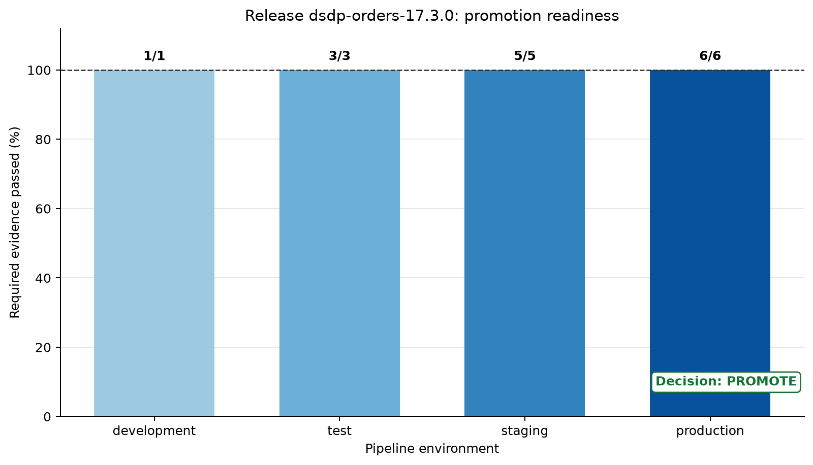

# CI/CD and Pipeline Environments {#sec-cicd-environments}

::: cdi-message
- **ID:** DSDP-017
- **Type:** Core chapter
- **Audience:** Data practitioners moving reliable pipelines from local development into production
- **Theme:** Release controls, environment separation, and immutable promotion
:::

## Learning objectives

By the end of this chapter, you will be able to:

- validate pipeline changes before merging;
- separate development, test, staging, and production configuration;
- promote versioned code and schemas through controlled releases;
- design CI checks and CD gates around data-specific failure modes; and
- produce auditable evidence that a release is ready for promotion.

## From a working pipeline to a releasable pipeline

A pipeline that runs successfully on a laptop is not automatically safe to release. Production delivery must answer a wider set of questions:

- Does the code pass unit, integration, and data-contract tests?
- Is the database migration compatible with the currently deployed version?
- Are credentials and endpoints selected at runtime rather than embedded in code?
- Can the exact artifact tested in staging be promoted to production?
- Is there a rollback or roll-forward path if the release fails?
- Can an operator reconstruct who approved the release and what evidence they saw?

Continuous integration (CI) supplies fast evidence about every proposed change. Continuous delivery (CD) packages a validated change and keeps it ready for controlled release. Continuous deployment goes one step further and releases every qualifying change automatically. Data pipelines often use continuous delivery with explicit production approval because schema evolution, backfills, external dependencies, and irreversible writes increase the cost of an unsafe release.

```{mermaid}
flowchart TD
    A["Commit and pull request"] --> B["Static checks and tests"]
    B --> C["Build immutable release"]
    C --> D["Deploy to staging"]
    D --> E["Smoke and contract checks"]
    E --> F{"Production gate"}
    F -->|Approved| G["Promote same release"]
    F -->|Rejected| H["Fix or retire release"]
```

The central principle is **build once, promote many**. Rebuilding separately for staging and production creates two artifacts with the same apparent version but potentially different dependencies or bytes. Promotion should change environment configuration, not application code or the release artifact.

## The four environments

Environment separation limits blast radius and makes validation progressive. The environment names matter less than their distinct purposes and controls.

| Environment | Main purpose | Data profile | Typical trigger | Primary controls |
|---|---|---|---|---|
| Development | Rapid iteration and debugging | Small, synthetic, or masked | Local command or feature branch | Developer credentials; disposable resources |
| Test | Repeatable automated verification | Deterministic fixtures | Pull request or push | Isolated services; no manual edits |
| Staging | Production-like release validation | Representative, protected test data | Successful CI on the release branch | Restricted access; smoke and contract tests |
| Production | Deliver trusted data products | Authoritative operational data | Approved promotion | Least privilege; monitoring; audit trail; recovery plan |

Separation must be real. Renaming four configuration files while all four environments share one database and one powerful credential does not provide isolation. Each environment should have its own resource identifiers, secrets, access policies, state, and retention rules.

## Configuration without code drift

Code defines pipeline behavior. Configuration supplies values that legitimately vary by environment: storage locations, database endpoints, schedules, concurrency limits, alert routes, and feature flags. Secrets are configuration values, but they require a dedicated secret manager and must never be committed.

The following environment variables illustrate a minimal runtime contract:

```bash
PIPELINE_ENV=staging
PIPELINE_INPUT_URI=s3://cdi-dsdp-staging/raw/orders/
PIPELINE_OUTPUT_URI=s3://cdi-dsdp-staging/curated/orders/
PIPELINE_SCHEMA_VERSION=3
PIPELINE_MAX_WORKERS=4
```

The application should validate this contract at startup and fail before processing if a required value is absent or invalid. A useful configuration layer follows three rules:

1. Safe defaults are limited to local development.
2. Environment-specific values enter through runtime configuration.
3. Secrets are referenced by identifier and resolved only inside the target environment.

Avoid a growing collection of conditionals such as `if production`. Those branches create behaviors that cannot be exercised faithfully before production. Prefer one code path with validated parameters.

## Version the complete release unit

A pipeline release is more than a Python file. It may include:

- source code and locked dependencies;
- transformation definitions;
- schema and data-contract versions;
- database migrations;
- infrastructure or orchestration definitions;
- runbooks and rollback instructions; and
- the commit SHA, build timestamp, and artifact digest.

A release manifest connects these elements. For example:

```json
{
  "release_id": "dsdp-orders-17.3.0",
  "commit_sha": "8b45d6f",
  "schema_version": 3,
  "artifact_digest": "sha256:...",
  "minimum_reader_schema": 2
}
```

Semantic versions can communicate compatibility to people, while a commit SHA and cryptographic digest identify exact source and artifact bytes. Use both when practical. A mutable label such as `latest` is convenient for exploration but inadequate for promotion or rollback.

## What CI must test for a data pipeline

Application tests are necessary but incomplete for pipelines. CI should layer inexpensive checks before slower ones so failures arrive quickly.

### Static and unit checks

The first layer checks formatting, linting, type assumptions, imports, and deterministic transformation units. Unit tests should cover boundary values, null handling, duplicate rules, time zones, and numerical tolerances. They should not require network access or shared infrastructure.

### Integration tests

Integration tests exercise real boundaries using isolated, temporary services. Examples include loading a fixture into a temporary PostgreSQL database, writing and rereading Parquet, or verifying object-store path construction. The test environment must be reproducible and disposable.

### Data-contract tests

A data contract describes what downstream consumers may rely on. CI can detect:

- removed or renamed required fields;
- incompatible type changes;
- newly nullable identifiers;
- broken uniqueness or referential rules;
- changed units, time zones, or category meanings; and
- unacceptable distribution changes in a representative fixture.

Schema compatibility is directional. Adding an optional field is often backward compatible; removing a required field is not. The release gate must evaluate compatibility against the deployed consumer contract, not merely confirm that the new schema parses.

### Migration and idempotency tests

Database migrations should be tested from the current production version to the proposed version. Where rollback is unsafe, test a roll-forward correction. Rerun the pipeline against the same fixture and verify that it does not duplicate rows or corrupt state. This connects delivery controls to the recovery and idempotency techniques developed in @sec-recovery-idempotency-backfills.

### Security and supply-chain checks

CI should scan committed content for secrets, inspect dependencies for known vulnerabilities, generate a dependency inventory where required, and build artifacts with narrowly scoped credentials. CI logs are not a safe place for tokens, connection strings, or raw production records.

## A promotion-readiness case study

Suppose an orders pipeline is moving from schema version 2 to version 3. The release adds an optional `discount_code`, preserves all required fields, and uses the same artifact digest across staging and production. The team defines six controls:

1. unit tests pass;
2. integration tests pass;
3. the proposed schema is backward compatible;
4. staging smoke tests pass;
5. the artifact digest matches the staged artifact; and
6. the recovery plan has been reviewed.

Run the companion script from the repository root:

```bash
bash scripts/bash/17-run-promotion-readiness.sh
```

It reads an explicit case-study manifest, evaluates the release controls, writes a machine-readable report, and generates @fig-promotion-readiness. The script exits with a non-zero status if any required control fails, which makes it usable as a CI gate.

{#fig-promotion-readiness}

The plot distinguishes evidence accumulated in CI and staging from the complete production gate. A high percentage is not a license to average away a critical failure: artifact identity and schema compatibility are mandatory controls. Therefore, the validator uses an all-required-controls rule rather than a weighted score to decide readiness.

The generated JSON report is suitable for retention with the workflow run:

```json
{
  "release_id": "dsdp-orders-17.3.0",
  "decision": "promote",
  "required_controls_passed": 6,
  "required_controls_total": 6
}
```

## Designing the CI workflow

The companion workflow at `.github/workflows/17-pipeline-ci-cd.yml` demonstrates the control flow. A production repository would adapt dependency installation, service containers, deployment commands, and cloud identity to its platform.

Key design choices include:

- **Minimum permissions:** the workflow begins with read-only repository contents.
- **Dependency caching:** caching speeds installation but never replaces version locking.
- **Separated jobs:** validation, build, staging verification, and production promotion have visible boundaries.
- **Immutable artifacts:** the build job records the commit SHA and artifact digest.
- **Environment protection:** the production job targets a protected environment where reviewers and branch rules can be configured.
- **Concurrency:** only one production promotion proceeds at a time.

Do not treat a CI configuration file as proof that controls are active. Repository settings must actually configure required status checks, protected branches, protected environments, authorized reviewers, and secret scopes.

## Staging as a release rehearsal

Staging should answer questions that CI cannot answer with isolated fixtures:

- Can the release start with target-environment configuration?
- Can it authenticate using staging identity and least privilege?
- Can it read and write expected formats and partitions?
- Are orchestration schedules, retries, and timeouts valid?
- Do lineage, metrics, logs, and alerts appear correctly?
- Can a representative downstream consumer read the output?

A smoke test should be small, fast, and diagnostic. It can process a bounded input partition into an isolated output prefix, validate row counts and schema, then remove or expire the test output. A full historical backfill is not a smoke test and should have its own capacity and approval plan.

Production-like does not mean copying unrestricted production data. Use synthetic, masked, tokenized, or carefully sampled data according to governance requirements. Preserve the shapes and edge cases required for meaningful validation without expanding sensitive-data exposure.

## Production gates

An effective gate asks for evidence, not confidence. Before approval, reviewers should see:

| Evidence | Question answered |
|---|---|
| Test summary | Did automated verification pass? |
| Schema comparison | Is the change compatible with deployed readers? |
| Artifact digest | Is this the same artifact tested in staging? |
| Migration plan | How will state move safely? |
| Recovery plan | How will the team contain and recover from failure? |
| Observability link | How will the release be watched after promotion? |
| Change record | Who approved what, and when? |

Manual approval is valuable only when the reviewer has the authority, context, and evidence to make a decision. A button that everyone clicks automatically is delay, not control.

## Deployment strategies for pipelines

Pipeline releases require strategies suited to scheduled work and persistent data.

### Shadow execution

Run the new version against a bounded copy or mirrored stream without publishing its output. Compare row-level results, aggregates, latency, and resource use. Shadow runs provide strong evidence when transformation logic changes, but they increase compute cost and require careful isolation.

### Canary execution

Send a limited partition, tenant, region, or percentage of input to the new version. Define success criteria and an automatic stop condition before starting. Canary boundaries must prevent two versions from writing conflicting state.

### Blue-green release

Maintain old and new pipeline environments or output locations, validate the new one, then switch a pointer or consumer view. This supports rapid reversal but requires duplicate capacity and careful handling of writes that arrive during the transition.

### Scheduled cutover

Pause at a safe watermark, deploy, validate state, and resume from an explicit checkpoint. This is common for batch pipelines. The acceptable pause duration and catch-up capacity must be known beforehand.

Whatever strategy is chosen, separate **code rollback** from **data recovery**. Restoring old code does not automatically reverse schema changes, emitted events, overwritten partitions, or downstream decisions. Sometimes the safest response is to stop writes, repair forward, and replay from a trusted checkpoint.

## Schema evolution as a release sequence

Breaking schema changes should be decomposed into compatible releases. An expand-and-contract sequence is safer than changing producers and consumers simultaneously:

1. Expand the schema with the new optional field or table.
2. Deploy consumers that understand both old and new representations.
3. Deploy producers that populate the new representation.
4. Backfill and verify historical state if required.
5. Observe until old readers and data are no longer present.
6. Contract by removing the deprecated representation in a later release.

This sequence turns one tightly coupled deployment into observable, reversible stages. Compatibility tests in CI should enforce the allowed transition at each stage.

## Secrets and environment identity

Use workload identity or short-lived credentials where the platform supports them. Avoid long-lived cloud keys stored as repository secrets. Each job and environment should receive only the permissions needed for its task:

- CI can read source and publish a release artifact.
- Staging deployment can update staging resources only.
- Production promotion can deploy the approved artifact but should not modify CI history.
- The pipeline runtime can access its defined inputs, outputs, checkpoints, and monitoring endpoints.

Prevent untrusted pull-request code from gaining access to protected secrets. Review how forked contributions, reusable workflows, shell interpolation, and third-party actions interact with credentials.

## Observability during promotion

A release is not complete when deployment succeeds. Define a post-promotion observation window and compare at least:

- run success and retry rates;
- freshness and end-to-end latency;
- input, accepted, rejected, and output row counts;
- contract and quality-rule failures;
- checkpoint or watermark movement;
- cost and resource saturation; and
- downstream consumer errors.

Annotate dashboards and logs with `release_id`, commit SHA, schema version, and environment. Without release metadata, an operator may see a regression but struggle to connect it to the change that caused it.

## Common failure patterns

### Rebuilding per environment

The production artifact differs from the staged artifact even though both use the same version label. Build once, calculate a digest, and verify the digest at every promotion boundary.

### Testing with production credentials

CI becomes a path into authoritative data and expands the blast radius of a compromised dependency or workflow. Give tests disposable resources and constrained identities.

### Environment-specific code branches

Production-only behavior remains untested. Keep one implementation and inject validated configuration.

### Treating deployment success as pipeline success

The scheduler accepted the new definition, but the first run produces late or invalid data. Add staging smoke tests and a production observation window with data-level signals.

### Automatic rollback after irreversible writes

Old code is restored while partially transformed data remains. Classify release actions by reversibility, stop unsafe writes, and use an explicit recovery or roll-forward procedure.

### Schema checks without consumer context

The proposed schema is internally valid but breaks an active reader. Compare changes against registered contracts and minimum supported reader versions.

## Practical release checklist

Before merging:

- [ ] Static, unit, integration, contract, and idempotency checks pass.
- [ ] The change has no committed secrets or environment-specific endpoints.
- [ ] Schema and migration compatibility are understood.
- [ ] Dependencies and workflow actions are pinned according to project policy.

Before production promotion:

- [ ] The staged artifact digest matches the approved release digest.
- [ ] Staging smoke tests and representative consumer checks pass.
- [ ] Runtime configuration and least-privilege identity are verified.
- [ ] Recovery, replay, and communication responsibilities are explicit.
- [ ] Monitoring views and post-release success criteria are ready.

After promotion:

- [ ] The first scheduled or triggered runs are observed through completion.
- [ ] Freshness, volume, quality, latency, and consumer signals remain within limits.
- [ ] Release evidence and approvals are retained.
- [ ] Temporary compatibility paths are assigned an owner and removal date.

## Exercises

### Exercise 1: Classify configuration

For a pipeline you know, classify each value as code, non-secret configuration, secret, or release metadata. Explain where it should be stored and who should be allowed to change it.

### Exercise 2: Break the gate safely

Copy `config/17-release-manifest.json`, set one required control to `false`, and run the readiness script against the copy:

```bash
python scripts/python/17-validate-promotion.py \
  --manifest path/to/modified-manifest.json \
  --report results/17-modified-readiness.json \
  --figure results/figures/17-modified-readiness.png
```

Confirm that the decision becomes `block` and the process exits unsuccessfully. Identify which CI job should surface this failure.

### Exercise 3: Plan an expand-and-contract migration

Choose one breaking schema change, then describe the producer, consumer, backfill, observation, and cleanup releases required to deliver it compatibly.

### Exercise 4: Define the observation window

Write five measurable success criteria for the first production run after promotion. Include at least one freshness measure, one data-quality measure, and one downstream-consumer measure.

## Key takeaways

- CI for pipelines must test data contracts, migrations, and idempotency in addition to application code.
- Development, test, staging, and production need genuinely isolated resources, identities, and state.
- Build a release once and promote the same versioned, digest-identified artifact.
- Production gates should require concrete evidence about compatibility, recovery, identity, and staging behavior.
- Deployment is complete only after the promoted pipeline processes data successfully under observation.
- Code rollback and data recovery are different operations and must be planned separately.

## Repository artifacts

This chapter adds the following executable and generated artifacts:

```text
17-ci-cd-and-pipeline-environments.qmd
.github/workflows/17-pipeline-ci-cd.yml
config/17-release-manifest.json
scripts/bash/17-run-promotion-readiness.sh
scripts/python/17-validate-promotion.py
results/17-promotion-readiness.json
results/figures/17-promotion-readiness.png
```
