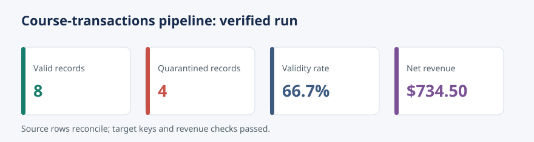

# End-to-End Pipeline Case Study {#sec-end-to-end-case-study}

::: cdi-message
- **ID:** DSDP-018
- **Type:** Applied case study
- **Audience:** Data practitioners completing the Databases, SQL, and Data Pipelines guide
- **Theme:** A reliable batch pipeline from raw input to an auditable analytical table
:::

## Learning objectives

By the end of this chapter, you will be able to:

- assemble extraction, validation, transformation, and loading stages;
- make a batch pipeline deterministic, idempotent, and observable;
- quarantine invalid records without silently losing evidence;
- verify warehouse outputs and operational metadata;
- evaluate the pipeline against reliability and governance requirements; and
- distinguish a successful process exit from a trustworthy data product.

## The case study

The CDI Learning Platform receives a daily export of course transactions. Analysts need a table that reports net revenue by transaction, course, customer segment, and transaction date. The source is deliberately small enough to inspect, but it contains conditions that production pipelines must handle:

- duplicate transaction identifiers;
- malformed timestamps;
- missing customer identifiers;
- unsupported transaction statuses;
- negative quantities; and
- reruns of the same input file.

The pipeline treats the raw file as immutable evidence. Valid rows are standardized and loaded into SQLite; invalid rows are written to a quarantine file with explicit reasons. Every run also emits a machine-readable manifest and appends one record to an operational run ledger.

```{mermaid}
flowchart TD
    A["Raw CSV extract"] --> B["Extract and fingerprint"]
    B --> C["Validate contract"]
    C -->|valid| D["Transform fields"]
    C -->|invalid| E["Quarantine CSV"]
    D --> F["Idempotent SQLite load"]
    F --> G["Reconciliation and checks"]
    G --> H["Run manifest and metrics"]
```

## Repository artifacts

The chapter package follows repository-relative paths.

| Path | Purpose |
|---|---|
| `data/raw/18-course-transactions.csv` | Immutable example source export |
| `configs/18-pipeline.json` | Dataset contract and runtime paths |
| `scripts/python/18-run-end-to-end-pipeline.py` | Extract, validate, transform, load, and verify |
| `scripts/bash/18-run-end-to-end-pipeline.sh` | Repository-root-aware execution wrapper |
| `tests/test_18_end_to_end_pipeline.py` | Unit and integration tests |
| `data/processed/18-valid-transactions.csv` | Valid standardized rows |
| `data/quarantine/18-invalid-transactions.csv` | Rejected rows and reasons |
| `data/warehouse/18-learning-platform.sqlite` | SQLite analytical warehouse |
| `results/18-pipeline-run.json` | Latest run manifest |
| `results/18-pipeline-run-history.csv` | Append-only operational ledger |
| `results/figures/18-pipeline-run-summary.svg` | Portable run-summary plot |

Generated outputs are included so the chapter can be read immediately. Running the pipeline recreates them from the source data.

## 1. Define the contract before moving data

The configuration file separates business rules from control flow. It declares the required columns, accepted statuses, currency, input location, and output locations. The pipeline still validates the configuration itself: a missing key should fail early rather than produce a partially correct dataset.

The transaction contract is:

| Field | Rule | Standardized representation |
|---|---|---|
| `transaction_id` | Required and unique within the extract | Text |
| `transaction_at` | ISO 8601 timestamp | UTC timestamp text |
| `customer_id` | Required | Text |
| `course_id` | Required | Text |
| `customer_segment` | One of `individual`, `organization` | Lowercase text |
| `status` | One of `completed`, `refunded` | Lowercase text |
| `quantity` | Positive integer | Integer |
| `unit_price` | Non-negative decimal | Decimal text rounded to two places |

Completed transactions produce positive net revenue. Refunds produce negative net revenue:

$$
\text{net revenue} =
\begin{cases}
q \times p, & \text{status = completed} \\
-q \times p, & \text{status = refunded}
\end{cases}
$$

Money is parsed with `Decimal`, not binary floating-point arithmetic. The warehouse stores integer cents, which makes reconciliation exact.

## 2. Extract without mutating the source

Extraction performs three control tasks before parsing business fields:

1. confirm that the input exists;
2. compute its SHA-256 fingerprint; and
3. confirm that its header matches the required schema.

The fingerprint is a compact identity for the exact source bytes. It connects the manifest, warehouse run ledger, and input file without renaming or editing the raw export. An identical rerun therefore has the same fingerprint.

## 3. Validate and quarantine explicitly

Validation is row-oriented so that one bad record does not hide the state of the rest of the batch. Each row is either accepted once or quarantined once. A rejected row carries one or more pipe-separated reason codes such as:

- `missing_customer_id`;
- `invalid_transaction_at`;
- `quantity_must_be_positive`; or
- `duplicate_transaction_id`.

This creates an important reconciliation invariant:

$$
\text{source rows} = \text{valid rows} + \text{quarantined rows}
$$

Quarantine is not deletion. It is an evidence-preserving workflow for investigation, correction, and controlled replay.

## 4. Transform valid records

Transformation normalizes categorical values, converts timestamps to UTC, derives `transaction_date`, and calculates `net_revenue_cents`. It also records `source_row_number`, `source_sha256`, and `pipeline_run_id`. These lineage fields make it possible to trace a warehouse record to a precise source row and execution.

The processed CSV provides a transparent interchange artifact. The SQLite table provides typed storage and SQL access. Both are produced from the same validated in-memory records, avoiding divergent business logic.

## 5. Load idempotently

The target table uses `transaction_id` as its primary key and an upsert as its load strategy. Reprocessing the same batch updates the same business keys instead of appending duplicates. The load occurs inside a database transaction, so either the batch and its run metadata commit together or neither does.

Idempotency does **not** mean that every metric stays unchanged. The second execution has a different run identifier and timestamp, and its manifest records a new operational event. The business table, however, converges to the same state for the same input.

```sql
SELECT
    transaction_date,
    course_id,
    SUM(net_revenue_cents) / 100.0 AS net_revenue
FROM fact_course_transactions
GROUP BY transaction_date, course_id
ORDER BY transaction_date, course_id;
```

## 6. Verify before declaring success

The pipeline checks the following conditions after loading:

- extracted rows equal valid plus quarantined rows;
- distinct valid transaction identifiers equal valid rows;
- all loaded transaction identifiers are present in the target;
- the source net-revenue total equals the corresponding warehouse total; and
- no null business keys exist in the loaded records.

A process that exits with code zero but fails reconciliation is not successful. The script raises an exception, rolls back when appropriate, and returns a non-zero exit status when an invariant fails.

The supplied run produces the following expected results:

| Metric | Expected value |
|---|---:|
| Source rows | 12 |
| Valid rows | 8 |
| Quarantined rows | 4 |
| Validity rate | 66.7% |
| Net revenue | $734.50 |
| Warehouse rows after load | 8 |
| Reconciliation status | `passed` |

{fig-alt="Four horizontal indicators summarize eight valid records, four quarantined records, a 66.7 percent validity rate, and 734 dollars and 50 cents net revenue."}

## 7. Observe the run

The manifest records the facts needed by both people and monitoring systems:

- run ID, start time, finish time, and duration;
- pipeline and schema versions;
- source path, byte size, and SHA-256 fingerprint;
- extracted, valid, quarantined, and loaded counts;
- validity rate and net revenue;
- reconciliation checks; and
- final status.

The latest-run JSON supports dashboards and incident diagnosis. The CSV history supports trend analysis across runs. In a production orchestrator, the same metrics would also be emitted to centralized logs and monitoring infrastructure.

## Running the case study

From the repository root:

```bash
bash scripts/bash/18-run-end-to-end-pipeline.sh
python -m pytest -q tests/test_18_end_to_end_pipeline.py
```

To run the Python entry point directly:

```bash
python scripts/python/18-run-end-to-end-pipeline.py \
  --config configs/18-pipeline.json
```

The script accepts `--run-id` for reproducible demonstrations and `--no-history` for tests or disposable runs.

## Inspecting the warehouse

Use Python when the SQLite command-line client is unavailable:

```python
import sqlite3

with sqlite3.connect("data/warehouse/18-learning-platform.sqlite") as connection:
    rows = connection.execute("""
        SELECT customer_segment,
               ROUND(SUM(net_revenue_cents) / 100.0, 2) AS net_revenue
        FROM fact_course_transactions
        GROUP BY customer_segment
        ORDER BY customer_segment
    """).fetchall()

print(rows)
```

Expected result:

```text
[('individual', 314.5), ('organization', 420.0)]
```

## Failure and recovery exercises

### Exercise 1: Schema drift

Rename `unit_price` in a copy of the raw file. Run the pipeline against the copy and confirm that extraction fails before the warehouse is modified. Explain why guessing a replacement column would be unsafe.

### Exercise 2: Correct and replay quarantine

Correct one invalid row in a new source file, give it a unique transaction identifier, and rerun. Confirm that the business table gains exactly one row and that reconciliation still passes.

### Exercise 3: Prove idempotency

Run the original batch twice. Query the fact-table count after each run. The run ledger should grow, but the fact table should remain at eight rows.

### Exercise 4: Add an operational threshold

Fail the pipeline when the validity rate falls below a configurable threshold. Decide whether that rule belongs before or after loading and justify the transaction boundary.

## Production hardening decisions

This local pipeline demonstrates the reliability pattern, but scale changes the implementation choices.

| Concern | Case-study choice | Production extension |
|---|---|---|
| Source | Local CSV | Object storage, API, CDC, or message stream |
| Execution | One Python process | Managed orchestrator with retries and SLAs |
| Storage | SQLite | Transactional warehouse or lakehouse |
| Secrets | None required | Secret manager and workload identity |
| Schema | JSON contract | Versioned schema registry and compatibility policy |
| Quality | Deterministic row rules | Dataset-level expectations and anomaly detection |
| Observability | JSON, CSV, SVG | Central logs, metrics, traces, alerts, and dashboards |
| Recovery | Safe rerun | Checkpoints, partition replay, and backfill controls |

The invariant stays the same: a pipeline must make data movement explainable, repeatable, and verifiable.

## Governance review

Before promoting the pipeline, answer these questions:

1. Who owns the source contract and approves changes?
2. How long should raw, quarantine, and run-history artifacts be retained?
3. Which fields contain personal or sensitive information?
4. Who may query the warehouse and who may inspect quarantine?
5. How are corrections approved and replayed?
6. Which run evidence is required for an audit?

This case study uses synthetic identifiers and contains no direct personal data. Real customer data would require documented classification, least-privilege access, encryption, retention limits, and deletion procedures.

## Reliability acceptance checklist

- [ ] The source is immutable and fingerprinted.
- [ ] Required columns and field rules are explicit.
- [ ] Invalid records retain reasons and lineage.
- [ ] The transform is deterministic for the same source and configuration.
- [ ] The business load is idempotent.
- [ ] Database writes use a transaction.
- [ ] Counts and monetary totals reconcile.
- [ ] Run metadata identifies code, schema, source, and outcome.
- [ ] Automated tests cover valid data, invalid data, and reruns.
- [ ] Recovery and ownership procedures are documented.

## Key takeaways

1. End-to-end reliability comes from connected controls, not from any single tool.
2. A source fingerprint and row-level lineage make results traceable.
3. Quarantine preserves evidence while allowing valid data to progress.
4. Primary keys and upserts make business-state reruns idempotent.
5. Reconciliation converts pipeline completion into a testable claim.
6. Operational metadata is part of the data product, not an afterthought.

## Chapter summary

This case study assembled a complete batch pipeline around a small transaction dataset. The implementation fingerprints the source, validates a declared contract, quarantines invalid rows, transforms money and timestamps deterministically, loads SQLite with idempotent upserts, and verifies record counts and revenue. Tests, a run manifest, a history ledger, and a summary plot demonstrate how engineering, observability, and governance work together. The same control pattern can be carried from a local teaching pipeline to a production platform even when the underlying storage and orchestration technologies change.
